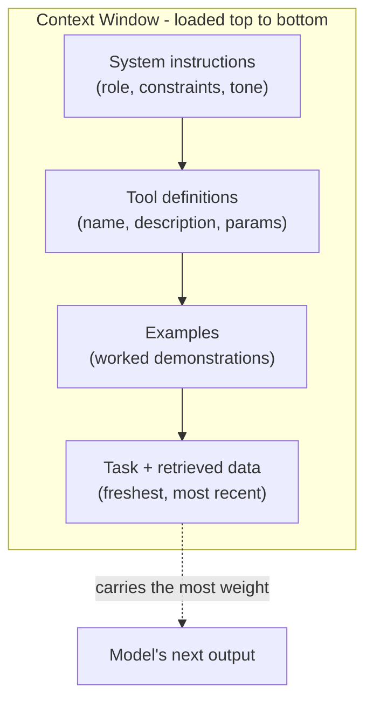
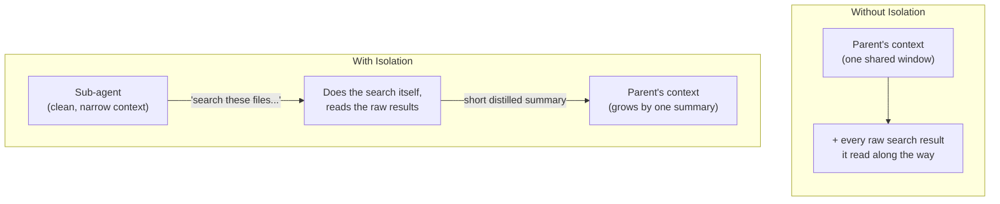

# 03 Context Engineering 

## What is Context Engineering? 

### Prompt Engineering vs. Context Engineering 

Recall that our AI unit was heavily based on prompt engineering, or techniques that maximize the quality of response based on the input (prompt) we provide a model. Prompt engineering relied mostly on token management for a single prompt, and typically didn't go too deep into the context provided to the LLM. 

**Context Engineering** is the process of optimizing *every* input given to an LLM to make it better at performing its task. This includes prompts, but expands to things like tools and data. 

### Context Engineering: Beyond Single Prompts

A single chatbot prompt has one job: get a good answer to the given question(s). An agent's context has to do a lot more, because the agent is running a whole loop (recall the 5-step agent workflow from `01-agent-basics.md`) and every step of that loop reads from the same shared context window. That context isn't just the user question anymore; it's the system instructions, the tool definitions, whatever data got retrieved along the way, the agent's own notes to itself, and the running history of what it's already tried. Balancing this mix of information is the difference between an agent that stays on task for 40+ steps and one that falls apart after 5.

## Tool Definitions as a Design Surface

Every tool an agent can call (we'll cover the mechanics of this in `04-tool-use-and-function-calling.md`) has to be described to the model *in the context window itself*: its name, what it does, and what arguments it takes. That description isn't free. It costs tokens on every single turn, whether or not the tool ends up getting used, and it shapes the model's behavior just as much as your instructions do.

This means tool definitions are something you *design*, not just something you bolt on. A tool named `get_data` with a one-line description invites misuse (the model doesn't know when to apply it) or gets ignored entirely (the model doesn't trust it enough to reach for it). A tool named `get_team_match_history` with a description that states its inputs, outputs, and edge cases gets used correctly, and only when appropriate. Loading in 30 tools "just in case" also means 30 tool descriptions permanently occupying context that could otherwise hold task-relevant data. So, the tools an agent has access to is itself a context engineering decision.

## Structuring Retrieved Data

Agents frequently pull in data they didn't write themselves: a database query result, an API response, a scraped webpage, a teammate's scouting notes. How that retrieved data is *formatted* inside the context window matters as much as whether it's accurate.

A wall of raw, unlabeled text forces the model to do extra work figuring out what information is where, and the more you force a model to do guess work, the more error-prone it becomes. Structured, labeled data (a small JSON object, a markdown table, a clearly delimited block with a header like `## Match 12 Results`) lets the model locate the specific fact it needs without re-parsing the whole blob. This gets more important as the retrieved data grows; a single match result can be pasted in raw, but a season's worth of scouting data needs real structure or it turns into exactly the kind of noisy middle-of-context material that triggers the Lost in the Middle Effect from `02-tokens-and-context.md`.

Revisit `ai_primer/05-structured-and-validated-outputs.md` for some tips on handling outputs to make sure you get what you need for the task at hand. 

## System Instructions vs. Examples, and Why Order Matters

Two different kinds of content usually load into an agent's context before the actual task ever starts: **system instructions** (standing rules about how the agent should behave like its role, its constraints, its tone) and **examples** (concrete demonstrations of the task done correctly, similar to the exemplars from Chain-of-Thought prompting in `ai_primer/04-prompt-engineering.md`).

These aren't interchangeable, and where you place them matters. Instructions placed early in context tend to act like standing law; the model treats them as constraints that apply to everything after. Instructions buried in the middle, after a long block of retrieved data, are exactly the content most likely to get lost. 

Examples work best placed close to the actual task they're demonstrating, not front-loaded miles away from where they're needed. A well-engineered agent context typically looks like: system instructions first, then tool definitions, then relevant examples, then the specific task and retrieved data last. This is because the freshest, most recent context tends to carry the most weight in what the model does next.

You'll see an example of how system instructions ensure persistence of rules and information in `11-agentic-coding-tools.md`, where something like a `CLAUDE.md` ensures Claude Code is following your specified instructions. 

Drawn out, that load order looks like this:



## Scratchpads and Structured Note-Taking

Long agent tasks generate intermediate state: partial results, decisions already made, things ruled out. Rather than relying on the model to keep all of that straight purely by reasoning over the whole conversation history, many agents are engineered to write it down in a **scratchpad**, or a designated space in context (or a file, in the case of coding agents) where the agent records its own working notes as it goes.

This matters for two reasons. First, it turns implicit reasoning into explicit, re-readable text, which is more reliable than hoping the model "remembers" a decision from 20 steps ago. Second, it gives you a designed place for state to live that isn't sensitive to where it falls in context: notes in a scratchpad can be pulled back to the top of context on the next turn instead of being left to decay in the middle of a growing transcript.

You can think of scratchpads as somewhat analogous to Chain-of-Thought, because it leaves us a trail of information to see the decisions an agent made. 

## Context Isolation: Sub-Agents with Clean Context

Not every problem is best solved by cramming more into one context window. Sometimes the better move is **context isolation**: splitting a task across multiple agents, each with its own separate context window, rather than one agent carrying everything.

A sub-agent given a narrow job (e.g., "search these files and report back what you find") doesn't need to see the parent agent's entire history to do that job well. If it did see that information, that irrelevant history would just be more noise competing for the model's attention. Instead, the sub-agent gets a clean, focused context containing only what it needs, does its work, and returns a short, distilled result to the parent agent. The parent's context grows by one summary instead of by everything the sub-agent read along the way. We'll build a concrete version of this pattern - a supervisor agent delegating to worker agents - in `07-multi-agent-systems.md`.

The difference isolation makes is a difference in what the parent's context has to hold:



## The Right Altitude Problem

Every piece of instruction you give an agent sits somewhere on a spectrum from rigid to vague, and both extremes fail in their own way.

Instructions that are too rigid (an exact script for every situation, an exhaustive if-this-then-that list) work fine for the cases you anticipated, but break the moment reality doesn't match the script. Instructions that are too vague ("use good judgment," "handle it appropriately") give the model no real guidance at all, which produces unpredictable improvisation: the agent might handle two near-identical situations in two completely different ways.

The right altitude is instructions specific enough to constrain the important decisions, but general enough to cover cases you didn't explicitly write down; closer to "if a tool call fails twice in a row, stop and report the failure instead of retrying indefinitely" than either "never retry" or "handle errors well." Finding that altitude is trial and error: you write instructions, watch where the agent actually struggles or misbehaves, and adjust the specificity up or down based on the *real* failure, not the imagined one.

## Try It

Below is a snippet of context that a scouting-question agent might be given at the start of a task, but it is deliberately engineered badly:

```text
[SYSTEM]
You are a helpful assistant.

[TOOLS AVAILABLE]
get_data(x): gets data

[RETRIEVED DATA]
team254 auto 3 pieces climb yes team1114 auto 2 pieces climb no team frc118 didnt climb
auto scored 4 pieces team 254 also missed 1 shot in teleop match 12 team 1114 broke down
match 14 climb attempt failed for team 118 heres more info about team 254 they average
14 points per match and rank 3rd overall team 1114 ranks 8th team 118 ranks 22nd currently

[TASK]
Tell me if team 254 is a good alliance pick.
```

1. Identify at least three separate context engineering mistakes in this snippet (there are more than three, so find as many as you can), using the sections above as your checklist: system instructions, tool definition, retrieved data structure, and placement/ordering.
2. Rewrite the snippet with each mistake fixed: give the tool a real name and description, structure the retrieved data (one team/match per line or a small table), and reorder so the most decision-relevant facts aren't buried in the middle of a run-on paragraph.
3. Paste both versions into a chat model with the same closing question ("Tell me if team 254 is a good alliance pick, and justify it with specific stats") and compare the two answers. Check specifically whether the bad version's answer uses or misses any of the buried facts (the missed shot, the rank, the climb rate) that the good version's answer catches.

## Resources

- [Effective Context Engineering for AI Agents](https://www.anthropic.com/engineering/effective-context-engineering-for-ai-agents) - Anthropic's own framing of context as a finite, curated resource, covering tool definitions, examples, and instruction placement (blog)