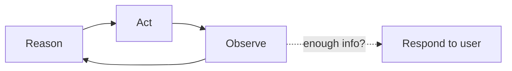
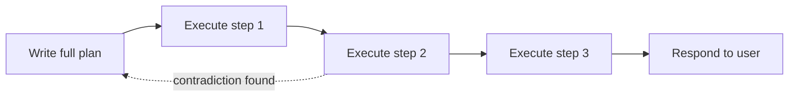

# 05 Planning and Reasoning Patterns

## From One Tool Call to a Real Plan

`04-tool-use-and-function-calling.md` gave the scouting agent one tool and one kind of question: look up a single team's history. But the questions a team actually wants answered rarely resolve in one call. "Recommend our 2 alliance team picks" requires pulling data on many teams, comparing them against several criteria, and producing a ranked, justified answer, which is a multi-step task. This module covers the patterns agents use to plan and reason across steps like that, rather than firing off one tool call and stopping.

## ReAct: Reason, Act, Observe, Repeat

The most common pattern is called **ReAct** (short for **Rea**son + **Act**), and it's close to what you already saw in the agent workflow in `01-agent-basics.md`, just made explicit. At each step, the agent does three things in sequence:

1. **Reason** - think in text about what it knows so far and what it needs next
2. **Act** - call a tool based on that reasoning
3. **Observe** - read the tool's result and fold it back into what it knows

Then it loops: reason again over the new information, decide the next action, and so on, until it decides it has enough to answer. Here's what that looks like for "recommend our next 3 alliance picks":

```text
Reason: I need our own team's current rank and playstyle first, before I can judge who
        complements us.
Act:    get_team_match_history(team_number=4930, event_code="2026casj")
Observe: Team 4930 averages 3 pieces/match auto, doesn't climb, ranks 9th.

Reason: We're weak on climb. I should look for high-climb-rate teams ranked well enough
        to plausibly accept an alliance invite from a 9th-ranked team.
Act:    get_rankings(event_code="2026casj")
Observe: Top 12 teams listed with rank and record.

Reason: Of the top 12, I need to check climb rate and auto score for each before ranking
        candidates - that's more than I can reason about from rank alone.
Act:    get_team_match_history(team_number=1114, event_code="2026casj")
Observe: Team 1114 climbs in 90% of matches, strong auto.

... (repeats for other candidate teams) ...

Reason: I now have climb rate and scoring for enough candidates to rank three picks.
Act:    (no tool call - responds directly)
Observe: N/A
```

Notice the loop doesn't have a fixed number of steps decided up front. The agent keeps reasoning-acting-observing until *it* decides it has enough, which is also exactly where things can go wrong (more on that in `08-guardrails-failure-modes-and-eval.md`, since nothing here stops the agent from looping forever if it never decides it has "enough").

## Plan-and-Execute

ReAct decides one step at a time, which is flexible but can wander. **Plan-and-execute** front-loads the thinking instead: the agent writes out a full multi-step plan *before* taking any action, then executes that plan step by step, only reconsidering the plan itself if something along the way contradicts it.

For the same alliance-pick question, a plan-and-execute agent's first output (before touching any tool) might look like:

```text
Plan:
1. Get our own team's stats and rank
2. Get the full event rankings
3. For each of the top 15 ranked teams, get match history (climb rate, auto score)
4. Score each candidate against: climb rate, auto consistency, rank
5. Return the top 3 by combined score, with justification
```

The advantage is that the plan is inspectable and editable *before* any tool calls happen. A human (or the agent itself, via self-critique below) can look at step 3 and say "15 teams is too many API calls, cap it at 8" before any of them run. The tradeoff is rigidity: if step 2's results reveal something the plan didn't anticipate (say, half the top-ranked teams have already committed to other alliances), a strict plan-and-execute agent may need to explicitly re-plan rather than adjust on the fly the way a ReAct loop naturally would.

The shape difference between the two is worth seeing directly, through a loop with no fixed length vs. a straight line with an escape hatch:

**ReAct** (loops until the agent decides it has enough):



**Plan-and-execute** (commits to a full plan first):



## Self-Critique and Reflection

Both patterns above can be paired with a **self-critique** (or **reflection**) step: after producing a draft answer, the agent is prompted to review its own output before returning it to the user, similar to the self-review turn from `ai_primer/07-sample-prompt.md`, except the agent runs this step on itself automatically rather than a human asking for it as a follow-up.

```text
Draft answer: "Recommend teams 1114, 2056, and 254 as alliance picks."

Self-critique: Did I check whether any of these teams have already accepted an alliance
invite from another team? No - I only checked rank and climb rate. I should verify
availability before finalizing this recommendation.

Revised answer: "Recommend teams 1114, 2056, and 254, pending confirmation that none
have committed to another alliance yet - I did not check current alliance status."
```

This catches a real gap the first pass missed, but it isn't magic; a self-critique step only catches what the agent thinks to check. If the agent never considers alliance status as something worth verifying, no amount of re-reading its own draft will surface it. Self-critique reduces certain classes of error; it doesn't guarantee correctness.

## Try It

Before looking at how an agent would actually do this, plan it yourself.

1. On paper, write out the plan **you** would follow, as a human scout, to answer: "Recommend our 2 alliance team picks," given access to full match data and rankings for the current event. Be as specific as you'd need to be to hand this plan to a teammate and have them execute it without asking you questions. \\
2. Now open a chat model (a plain chatbot is fine) and prompt it with something like: *"You are a scouting agent for an FRC team ranked 5th at our event. Using a ReAct-style approach, write out your reasoning and planned tool calls (you can invent plausible tool names) to recommend our 2 alliance team picks. Think step by step and show your plan before acting."* \\
3. Compare the two plans side by side. Specifically identify:
   - One step you included that the agent's plan skipped
   - One step the agent's plan included that you hadn't thought to check
   - One place where your plan and the agent's plan checked things in a different order, and whether that order difference would actually change the final recommendation 

Write two or three sentences on which plan you'd trust more for a real competition, and why, and whether the answer changes if the agent's plan also includes a self-critique step.

## Resources

- [ReAct: Synergizing Reasoning and Acting in Language Models](https://arxiv.org/abs/2210.03629) - the paper this module's Reason/Act/Observe loop is named after (paper)
- [Reflexion: Language Agents with Verbal Reinforcement Learning](https://arxiv.org/abs/2303.11366) - the paper behind the self-critique/reflection pattern (paper)
