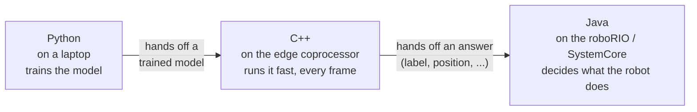
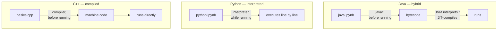

# 00 Why Three Languages?

You've probably seen that the vast majority of our programming is in Java. That's normal! WPILib and the command-based framework are built around it, and it's genuinely a good fit for running a robot. So why does this curriculum also cover Python and C++?

Because a competitive FRC software stack shouldn't be limited to one program. It should be three, each doing a job the others are bad at.

## Three Languages, Three Roles

**Java runs the robot.** Every subsystem, command, and button binding on the roboRIO is Java talking to WPILib. Java's job is orchestration. This includes reading joystick input, sequencing autonomous routines, and more. It doesn't need to be blazingly fast. It needs to be organized, safe, and easy for a whole subteam of students to read and extend without stepping on each other's code. That's what command-based architecture is for, and it's why Java is the right choice here.

*A hardware note:* the **roboRIO** is the controller FRC teams have been using (including us in our older robots). Starting the 2027 build season, FRC is replacing it with a successor called **SystemCore**. It does the same job, but with different hardware. Everything this curriculum teaches about Java's orchestration role applies equally to both, so you need to recognize both names. You'll keep working on roboRIO hardware for now, but SystemCore is what you should expect to be prepping for by build season.

**Python trains the models.** If you do any machine learning, that work almost never happens in Java or C++. It happens in Python, because the entire ML research world lives there first. Python's job is prototyping: try an idea, look at the data, retrain, repeat, fast. You are not going to run this training loop on the robot. You are going to run it on a laptop, produce a trained model, and hand that model off to something else to use during a match. 

**C++ runs inference at the edge.** "The edge" means hardware bolted to the robot that isn't the roboRIO (or SystemCore). It's a coprocessor like a Raspberry Pi or Orange Pi, often paired with a camera, running a vision pipeline. This is what tools like PhotonVision and Limelight are actually doing under the hood. That coprocessor needs to take a camera frame, run it through the model Python trained, and produce an answer (e.g"here's the AprilTag, here's its position") in single-digit milliseconds, every frame, forever, without ever pausing. C++ is what you use when milliseconds and memory footprint actually matter, because it gives you direct control over both. That's why the vision libraries these tools lean on under the hood — OpenCV, AprilTag detection — are themselves written in C++, even when a tool's outer layer (PhotonVision's pipeline code, for instance) is Java.

TLDR; Python is where the model is *born*, C++ is where it *runs fast*, and Java is where the robot *decides what to do* with the answer.

You'll see this exact shape again, for real, in `05_capstone_pipeline`; this is the one-sentence version of the whole curriculum.

## Two Big Ideas for Later

You don't need to master these yet, but you should have a working understanding for later. 

**Compiled vs. interpreted.** A compiled language (C++) is translated into machine code by a compiler *before* you ever run it. You get an executable file that the computer runs directly, with no translation happening at runtime. An interpreted language (Python) is read and executed line-by-line by another program (the interpreter) *while it's running*. Java is a hybrid: it's compiled to an intermediate form (bytecode) ahead of time, and then the JVM interprets/just-in-time-compiles that bytecode at runtime. This distinction is why C++ programs generally start faster and run faster with more predictable timing; there's no interpreter sitting in the middle at runtime. It's also why Python is more forgiving to experiment in; there's no separate compile step between changing your code and running it.

Notice C++ and Java both have a step that happens *before* you run anything — that's what "compiled" means — while Python goes straight from source to running. Java's bytecode step is why it's a hybrid rather than a clean fit for either category.

**Static vs. dynamic typing.** In a statically typed language (Java, C++), every variable's type is fixed and checked *before* the program ever runs. If you try to put text into a variable declared to hold a number, the compiler stops you before you can even build the program. In a dynamically typed language (Python), a variable's type is only checked *while the program is running*, and the same variable can hold a number at one moment and text the next. Static typing catches a whole category of mistakes early and makes large codebases (like a season's worth of robot code) easier to maintain; dynamic typing makes quick experimentation (like trying out an idea in a training notebook) faster to write.

It so happens that there's a real tradeoff between compiled vs. interpreted and static vs. dynamic. Python tends to be more human-readable (and by consequence, "easier" to program in), but that readability comes at a real speed and memory cost. C++ may be more difficult to program in, and a human needs more help reading it, but it is consequentially much faster for a computer to process. 

Keep both distinctions in mind as you move through the next few topics, and you will begin to understand why each language looks the way it does.

## Resources

- **Java:** [What is WPILib?](https://docs.wpilib.org/en/latest/docs/software/what-is-wpilib.html) - the official orientation to the library and toolchain Java's role in this curriculum is built around.
- **Python:** [Python.org: About Python](https://www.python.org/about/) - the language's own pitch for itself, from the source.
- **C++:** [isocpp.org](https://isocpp.org/) - the Standard C++ Foundation's home page: news, FAQs, and the people who steward the language.
