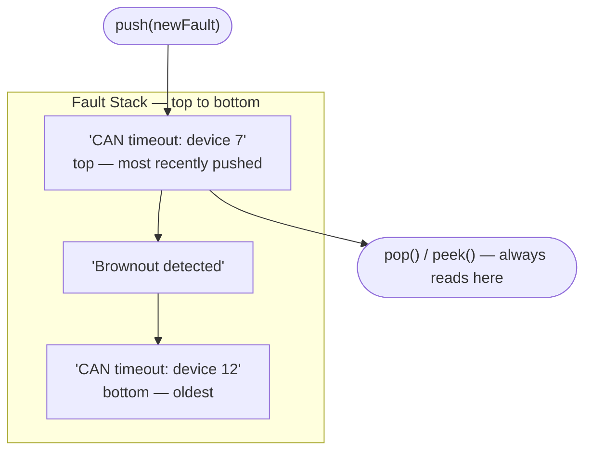
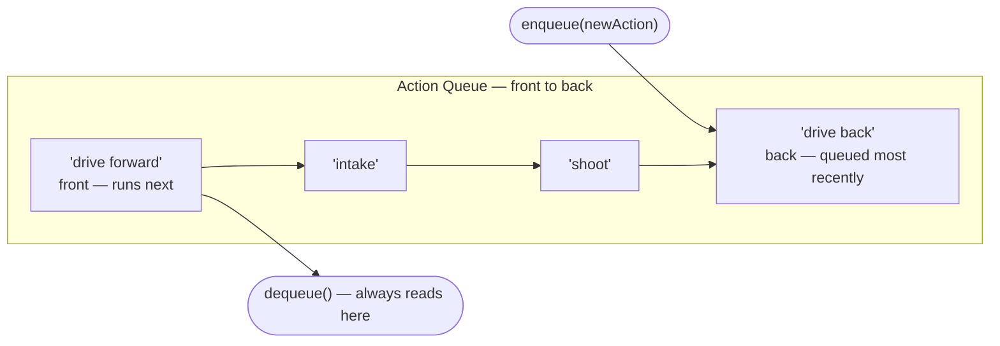
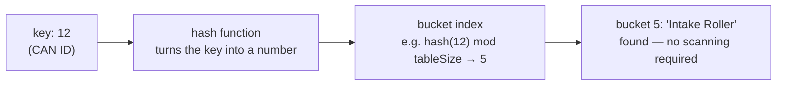
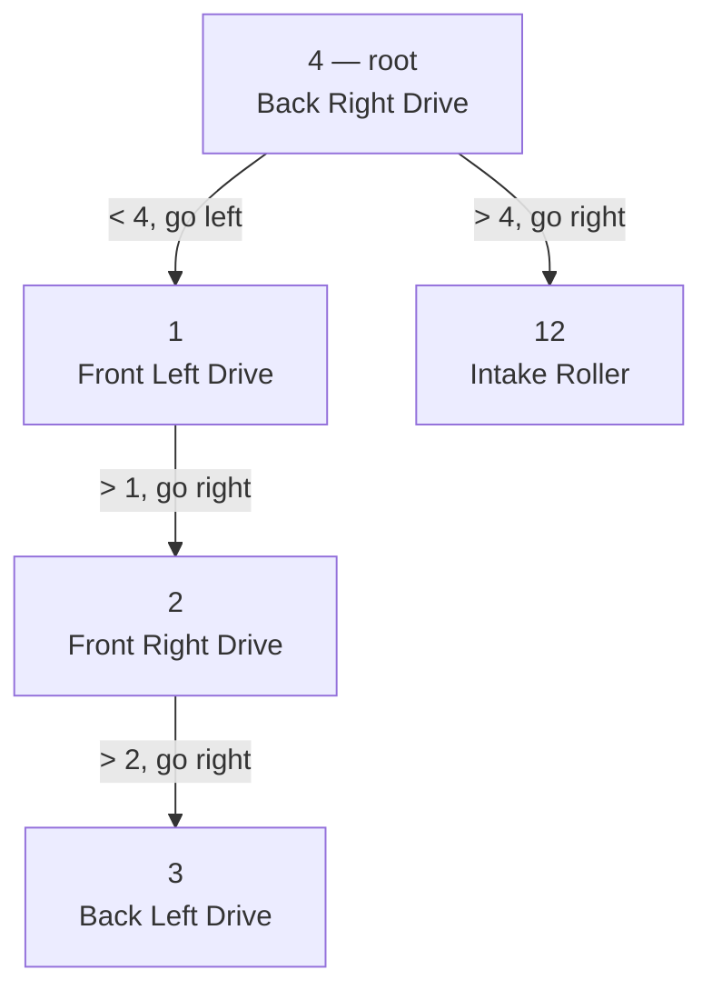
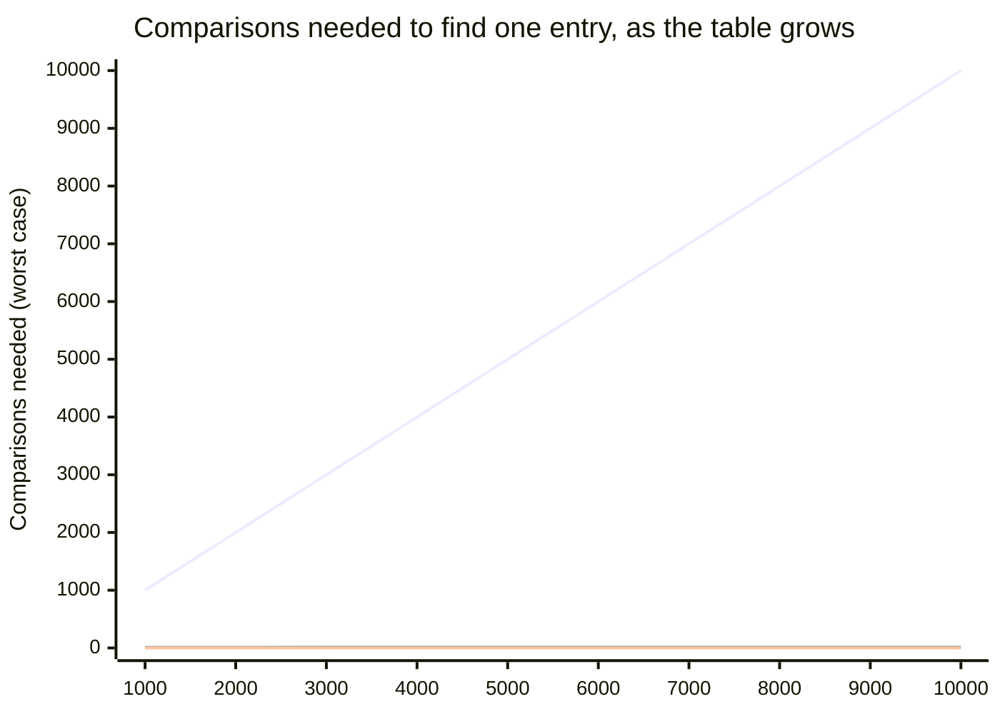

# 03 - Data Structures and Algorithms: Stacks, Queues, Hashmaps, Trees, and Big-O

Every one of the "collections" mentioned briefly back in `01_basics` is really just one specific way of organizing a group of values. Which way you pick changes what operations are fast and what operations are slow. This topic covers four of the most common organizing patterns, one algorithm that pairs naturally with the last one, and the vocabulary for talking precisely about "fast" and "slow" — in both time and memory — in the first place.

We're going to motivate this with an example. You have a diagnostics system tracking three things about a robot during a match: recent controller faults, a queued sequence of autonomous actions, and a lookup table from CAN bus IDs to human-readable device names.

## Stacks: Last In, First Out (LIFO)

A **stack** only lets you interact with one end of a collection: you can **push** a new value onto the top, or **pop** the most-recently-pushed value back off. Whatever went on last comes off first, AKA Last In, First Out (LIFO).

This fits our fault list well: when a motor controller reports a fault, you push a description of it onto a fault stack. When the driver station displays "most recent fault," it's popping (or just peeking at) the top of that stack. The most recent one is always sitting right there, without searching through everything that happened before it. You'd reach for a stack any time "most recent first" is the natural order you want, including things like an undo history or tracking how deeply nested your currently-running command groups are.

Both `push` and `pop`/`peek` only ever touch the `top` box. That's the whole definition of a stack: everything happens at one end, and whatever's underneath just waits its turn.

## Queues: First In, First Out (FIFO)

A **queue** also restricts you to the two ends of a collection, but the other direction: you **enqueue** (add) at the back and **dequeue** (remove) from the front. Whatever went in first comes out first, AKA First In, First Out (FIFO). This is just like a "queue", or "line", in real life.

This fits a sequence of autonomous actions: "drive forward, then intake, then shoot, then drive back" needs to run in exactly the order it was queued, not the reverse. You enqueue each action as it's planned, and a loop dequeues and executes them one at a time, in order. Any time order-of-arrival needs to be preserved — a queue of vision detections to process, a queue of log messages to write out, etc. — a queue is the right shape.

New actions join at `back`; execution always reads from `front`. That separation of ends is what keeps arrival order intact. A stack couldn't do this, because it would hand back `drive back` first instead of last.

## Hashmaps: Lookup by Key

A **hashmap** stores **key-value pairs** and is built to answer one question extremely fast: "given this key, what's the value?" Instead of a numeric position (like an array index), you look things up by whatever key makes sense for your problem. Python calls these "dictionaries", and for good reason: if you're looking up the definition of a word (or, a value) in the dictionary, you look it up by the word itself (or, the key). 

For our diagnostics example: instead of storing device names in a plain list and scanning through it every time you need to translate a CAN ID into a readable name, you store them in a hashmap keyed by CAN ID. Handed an ID, the hashmap goes almost straight to the matching name.

That's the whole trick: the hashmap doesn't search for `12`, it computes *where `12` would be* and goes straight there. Compare that to the linear scan below, which has no such shortcut and has to check entries one at a time.

A hashmap's one real limitation is that, unlike a real-life dictionary, it does not keep keys in any kind of order. Iterating over one gives you entries back in whatever order its internal hash table happens to store them, not sorted by key. If you need "every device, in CAN ID order" for a diagnostics printout, a hashmap alone can't give you that without a separate sort step.

## Trees: Sorted Lookup, Hierarchically

A **tree** is built from **nodes**, each holding a value and pointing to some number of **children**. It starts from one **root** node at the top, the same way a folder on your computer contains files and other folders, which contain more files and folders. Trees can keep their nodes arranged by key; walking the whole thing in order gives you every entry sorted, for free.

A **binary search tree (BST)** is the simplest useful version: every node holds a key (here, a CAN ID) and a value (its device name), plus a pointer to a **left child** whose key is smaller and a **right child** whose key is larger. Searching means starting at the root and, at each node, comparing the key you want to the current node's key: go left for something smaller, right for something larger, stop the moment you find a match or run out of tree.

For our diagnostics example, storing the CAN-ID-to-device-name table in a BST instead of a hashmap means you can still look a device up quickly by ID, but you can *also* walk the tree to print every device in ID order.

Here's that exact table as a BST, built by inserting CAN IDs in this order: 4, 1, 12, 2, 3.

Searching for ID `12` takes two comparisons: start at the root (`4`), `12 > 4` so go right, and you've landed on `12`, and you're done. Searching for ID `3`, on the other hand, takes four: `3 < 4` go left to `1`, `3 > 1` go right to `2`, `3 > 2` go right to `3`, and you're done. Notice the right-leaning chain `1 → 2 → 3`: because those three IDs happened to be inserted in increasing order relative to each other, that corner of the tree is lopsided instead of balanced, and a lookup down that side costs more comparisons than one down the `12` side. A real, self-balancing tree would correct for this; this simple version doesn't, which is exactly why `main.cpp`'s comments warn against inserting a large, already-sorted batch of keys into one.

## Algorithms: Binary Search

Everything above has been about *organizing* values. An **algorithm** is a step-by-step procedure for actually *doing* something with them, independent of how they happen to be stored. **Binary search** is the general version of the searching idea from the BST above, and it works directly on a plain sorted array or list too.

Given a *sorted* collection and a target value: check the middle element. If it matches, you're done. If the target is smaller, repeat the same check on the left half; if larger, repeat on the right half. Each comparison throws away half of whatever's left, the same as the BST search above: binary search *is* what a BST search is doing, just without needing an actual tree of node objects to do it.

The one precondition that makes this work is that the data has to already be sorted. Binary search doesn't work on an unsorted collection. That precondition is exactly the tradeoff: sorting data up front (or keeping a BST balanced) costs something, in exchange for every future search being dramatically cheaper than checking one entry at a time.

## Big-O: How "fast" and "slow" get made precise

**Big-O notation** describes how the *cost* of an operation grows as the *amount of data* grows. The cost associated with an operation is also known as its **complexity**. This is not about how many milliseconds it takes on one specific machine, but the underlying shape of the growth. (If you want a gentler, notation-free warm-up to this idea first, `general_programming_resources/12_complexity_performance_intuition` covers the same instinct — noticing when a nested loop's cost is going to blow up — without the formal notation below.)

 You'll see three shapes constantly:

- **O(1) — constant time.** The cost doesn't depend on how much data there is. A hashmap lookup by key is (on average) O(1): whether you have 5 entries or 5,000, finding the one you want takes roughly the same amount of work. You find one key, return one value. 
  
- **O(log n) — logarithmic time.** The cost grows, but much slower than the data does — every *doubling* of the data adds only one more step. Binary search (and a balanced BST lookup) is O(log n): searching 1,000 sorted entries takes about 10 comparisons, and searching 1,000,000 takes only about 20.
  
- **O(n) — linear time.** The cost grows in direct proportion to the amount of data, where *n* is the number of items. Scanning a plain list from the front until you find a matching CAN ID is O(n): in the worst case, you check every single entry, and doubling the list roughly doubles the worst-case work.

Here are all three shapes plotted against the same growing table, worst case:

The linear scan's line is, well, a line. It's straight up and to the right. The other two are so flat by comparison they look glued to the bottom of the chart, even though the table just grew to 10,000 entries. That squashed-flat look *is* what "barely grows at all" means in practice, not just in words.

This is exactly why the hashmap and the sorted-array-plus-binary-search both beat a plain linear scan for the CAN ID lookup: the same task, "find the entry matching this ID," costs O(1) with a hashmap, O(log n) with binary search over sorted data, and O(n) with a linear scan. On most software this difference is invisible. On a robot, it isn't automatically invisible: your control loop runs on a fixed schedule (WPILib's default is every 20 milliseconds), and every one of those 20-millisecond windows has to fit *all* of your robot's logic, including any lookups. An O(n) scan that's fast enough today can quietly become your bottleneck the moment a list it depends on grows, while an O(1) or O(log n) lookup barely notices.

It is extremely important to note that just because an operation has O(n) complexity, for example, it does not mean it will actually take n operations to complete. For a target sitting near the very *front* of the table, the linear scan can take *fewer* comparisons than binary search on that one specific call, because a linear scan's best case (an early match) is cheap no matter how big the data gets. That's not a contradiction. Big-O describes the *worst case as the data keeps growing*, not a promise that the asymptotically-better algorithm wins every individual call. Binary search's guarantee is that it never gets much worse than roughly log₂(n), no matter where the target sits; linear search's worst case keeps getting worse as the table grows, even though its best case can still look cheap on any one lucky run.

### Time vs. space: the other half of Big-O

Everything above measures *time*, or how many operations something needs as data grows. Big-O describes **space** the same way: how much *memory* a data structure needs as data grows, again as a shape rather than an exact byte count.

The tradeoff is concrete in what you've already seen. A linear scan over a plain list uses exactly as much memory as the data itself — O(n) space, nothing extra — but pays for it in O(n) time. A hashmap gets its O(1) *time* by spending extra *space*: it allocates a table sized larger than the number of entries it actually holds, so collisions stay rare. A BST sits in between; one or two extra pointers per node beyond the hashmap's overhead, in exchange for keeping entries sorted. None of these is unconditionally "best", so what you use depends on your prioritization of reducing operations or saving memory.

On a robot this tradeoff isn't abstract. The roboRIO (or its 2027 successor, SystemCore), and any coprocessor you're running inference on, both have a hard memory ceiling, and unlike a laptop, there's no swap space to quietly fall back on if you run out. A structure that's fast but memory-hungry can be the wrong choice on constrained hardware even if it's the obvious choice everywhere else. This is exactly why `00_why_three_languages` sold C++ on giving you direct control over memory footprint, not just speed; on the edge, space complexity is as real a constraint as time complexity.

Big-O isn't about memorizing which structure is "best". It's the tool for asking "will this scale, in time and in memory, if the input grows?"

## Putting it together

`java.ipynb` and `python.ipynb` build this exact fault-stack / action-queue / CAN-ID-lookup set using each language's built-in collection types, add a hand-built binary search tree over the same CAN ID table, and run a three-way Big-O demo comparing a linear scan, binary search over sorted data, and a hashmap lookup as the amount of data grows. `cpp/dsa.h` and `cpp/dsa.cpp` build the same structures. For the stack and the tree specifically, build them from scratch out of nodes connected by pointers, which is exactly the pointer and reference material from `02_oop_inheritance` put to real, practical use.

## Resources

- **Java:**
  - [Oracle Java Tutorials: The Collections Framework](https://docs.oracle.com/javase/tutorial/collections/index.html) - `Deque`, `HashMap`, and the rest of Java's built-in data structures.
  - [Big-O Cheat Sheet](https://www.bigocheatsheet.com/) - time/space complexity for common data structures and algorithms.
  - [GeeksforGeeks: Binary Search Tree](https://www.geeksforgeeks.org/binary-search-tree-data-structure/) - a deeper look at BST operations, including the delete/rebalancing cases this notebook doesn't cover.
  - [WPILib `SequentialCommandGroup`](https://docs.wpilib.org/en/stable/docs/software/commandbased/command-groups.html) - the real queue-like structure behind chained autonomous actions on the robot.
- **Python:**
  - [Python `collections.deque` docs](https://docs.python.org/3/library/collections.html#collections.deque) - the real implementation behind the queue example above.
  - [Big-O Cheat Sheet](https://www.bigocheatsheet.com/) - time/space complexity for common data structures and algorithms.
  - [GeeksforGeeks: Binary Search Tree](https://www.geeksforgeeks.org/binary-search-tree-data-structure/) - a deeper look at BST operations, including the delete/rebalancing cases this notebook doesn't cover.
  - [WPILib `SequentialCommandGroup`](https://docs.wpilib.org/en/stable/docs/software/commandbased/command-groups.html) - the real queue-like structure behind chained autonomous actions on the robot.
- **C++:**
  - [cppreference: Containers library](https://en.cppreference.com/w/cpp/container) - the official overview of `std::deque` and friends, the built-in equivalents of the structures `dsa.h`/`dsa.cpp` build by hand.
  - [cppreference: `std::deque`](https://en.cppreference.com/w/cpp/container/deque) - the specific container backing the queue example, if you'd reach for the standard library instead of hand-rolled nodes.
