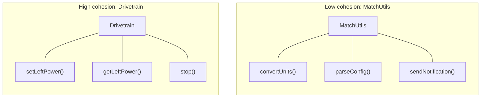
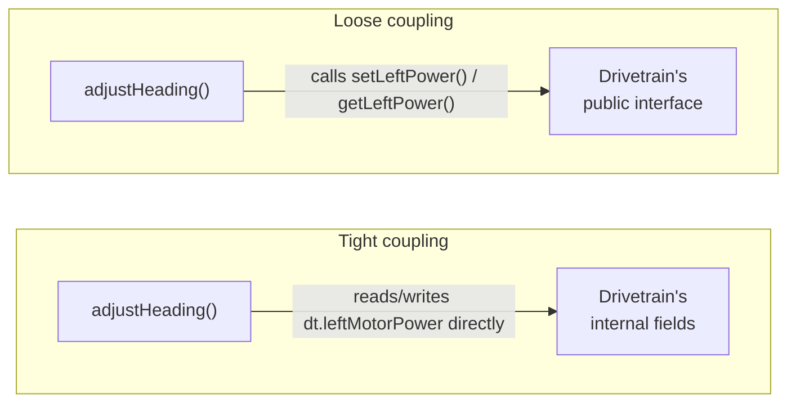

# 02 - Code Organization & Modularization

## Structure is a Habit

Two codebases can do the exact same thing and take wildly different amounts of time to change. The difference is almost never the language, but rather the organization of the code; if you change one constant, or one class, does this change proliferate throuhgout the repo? Or are you stuck manually finding where the changes didn't apply? This module is about four ideas that make that difference: **single responsibility**, **coupling and cohesion**, **interface design**, and **naming**. All four apply equally across languages. 

## Single Responsibility

A function or class should have **one reason to change**. Not one line of code, not one instruction — one *reason*. A function that reads a sensor, decides what to do with the reading, drives a motor, and logs all of it has at least four reasons to change: the sensor's units, the decision logic, the motor interface, and the log format could each change independently, and every one of those changes means editing the same block of code.

```java
// One function, four responsibilities, one reason each to break the others
void doStuff() {
    double x = sensor.read();
    double y = x > 10 ? x * 0.5 : x * 2;
    System.out.println("output=" + y);
    motor.set(y);
}
```

```python
# Same problem, same shape, different language
def do_stuff():
    x = sensor.read()
    y = x * 0.5 if x > 10 else x * 2
    print(f"output={y}")
    motor.set(y)
```

The fix isn't to write less code. It's to split this into named pieces, each with one job: something that reads the sensor, something that decides the output value, something that drives the motor, something that logs. Each piece becomes easy to test, reuse, and change without touching the others. If something goes wrong, you can isolate the problem much faster. 

## Coupling vs. Cohesion

These two ideas are opposite ends of the same measurement:

- **Cohesion** is how related the things *inside* one function, class, or module are. High cohesion means everything in there is working toward one clear job. A class called `MatchUtils` with an unrelated grab-bag of static helpers (`convertUnits`, `parseConfig`, `sendNotification`) has low cohesion, because none of these actually work with one another. 
- **Coupling** is how entangled *separate* pieces are with each other. Low coupling means you can change one piece's internals without breaking another. High (or "tight") coupling means one class reaching directly into another's internal fields, or one module depending on exactly how another one is implemented instead of just what it promises to do.



`MatchUtils`'s three methods have nothing to do with each other; they just happen to live in the same class. `Drivetrain`'s three methods are all in service of one clear job. Same number of methods, very different cohesion.

```cpp
// Tight coupling: this function depends on Drivetrain's internal fields directly
void adjustHeading(Drivetrain& dt) {
    dt.leftMotorPower = dt.leftMotorPower * 0.9;  // reaching into internals
}
```

```cpp
// Loose coupling: this function only depends on a public interface Drivetrain promises to keep
void adjustHeading(Drivetrain& dt) {
    dt.setLeftPower(dt.getLeftPower() * 0.9);
}
```



Tight coupling reaches straight past whatever boundary `Drivetrain` has and grabs its internals directly; loose coupling only ever crosses through the one interface `Drivetrain` promised to keep.

The goal is **high cohesion, low coupling**: each piece does one clear job internally, and pieces talk to each other only through a clean, stable interface. A `useState` hook and the component holding it are meant to be tightly cohesive; that same component reaching into a *sibling* component's internal state directly (instead of through props or a shared parent) is what this idea warns against, and it's the reason React's one-way data flow exists in the first place.

## Designing a Clean Interface

The loosely-coupled `adjustHeading` above worked because `Drivetrain` had already been designed with a deliberate interface: `setLeftPower`/`getLeftPower`, exposed on purpose. Functions and interfaces define a specific agreement with their caller: these are the inputs it accepts, this is what it returns, these are the side effects (if any) it has. The moment any other code depends on that promise, any changes to the promise can break that other code. This is why it is crucial to be intentional about the way you design interfaces, *before* you code anything else. 

Two habits make an interface easier to depend on:

- **Minimal surface area.** Expose only what a caller actually needs, and keep everything else private or internal. This draws on two related but distinct ideas. **Abstraction** is hiding complexity behind a simple interface — a driver only needs to know a car can start, accelerate, and brake, not the specifics of how the pistons work. **Encapsulation** is the more specific practice of protecting an object's internal state from outside interference: a method that returns a direct reference to an internal mutable list lets every caller silently corrupt it, while returning a copy instead keeps that promise narrow and safe. Every additional public field, method, or parameter is one more thing every future caller — and every future maintainer — has to understand, and one more thing that can't change later without breaking something. `back_end_resources/language_primer/02_oop_inheritance`'s "Encapsulation and access modifiers" section covers the actual `public`/`private` mechanics behind this in Java, C++, and Python; this module is about the reasoning that makes reaching for them worthwhile in the first place.

- **Sensible defaults.** A parameter with a reasonable default (`connect(timeout=2.0)`) keeps the common case simple for a caller who doesn't need to think about it, while still letting an unusual caller override it explicitly when they do.

None of this is a separate skill from coupling and cohesion; it's the same idea from the caller's side of the fence. A well-designed interface is what makes low coupling possible in the first place, by giving every other piece of code something narrow and stable to depend on instead of your implementation's internals.

## Naming as a form of documentation

A name is the cheapest, most-read piece of documentation you will ever write, because every single person who touches your code reads the names before they read anything else. `doStuff()`, `x`, `y`, `flag2`, `tmp` all describe nothing. They force the next reader (often you, when we go over old codebases) to read the entire function body just to find out what a variable holds or what a function does. Compare:

| Bad | Good | Why |
|---|---|---|
| `x`, `y` | `sensorAngleDegrees`, `motorPowerOutput` | says what the value *is*, not just that it exists |
| `doStuff()` | `computeMotorPowerFromAngle()` | says exactly what happens, not that "something" does |
| `flag2` | `isHoldModeActive` | says what the boolean *means*, not that it's the second one you needed |
| `tmp` | `previousHeading` | says what the value is *for* |

A well-named function often needs zero comments to explain *what* it does, because the name already says it.

## Putting it together

Open `examples/messy_autonomous/`. This is the same badly-organized routine in Java and Python, seeded so its output is reproducible. Run whichever version(s) you're comfortable in and record the output, then refactor it: split it into single-responsibility, well-named pieces (a sensor-reading function, a decision function, a motor-driving function, a logging step) without changing what it actually does. Once you re-run it after, the output should be identical, just produced by code that's intentionally organized instead of accidentally organized. That covers single responsibility and naming; `examples/coupled_drivetrain/` and `exercises/exercise-2-decouple-and-encapsulate.md` pick up coupling/cohesion and interface design the same hands-on way — refactoring a leaky, tightly-coupled `Drivetrain` into a clean one, then proving the fix actually protects its internal state instead of just reading that it does.

## See also

- **`03_file_project_structure`** — this module is about organization *inside* a function or class; `03` is the same idea one level up, at the file and folder level.
- **`09_refactoring_technical_debt`** — the process of improving structure incrementally in code that already works, without breaking it, once you've spotted a problem like the one in this module's example.
- **`04_documentation`** — where the "naming vs. commenting" boundary gets picked back up in full.
- **`back_end_resources/language_primer/02_oop_inheritance`** — the `public`/`private` access-modifier mechanics behind this module's encapsulation half of "Designing a Clean Interface," in whichever language you're using.

## Resources

- [Wikipedia: Single-responsibility principle](https://en.wikipedia.org/wiki/Single-responsibility_principle) - the formal statement of the idea this module opens with.
- [Wikipedia: Coupling (computer programming)](https://en.wikipedia.org/wiki/Coupling_(computer_programming)) - a deeper look at degrees of coupling, from loose to tight.
- [Wikipedia: Cohesion (computer science)](https://en.wikipedia.org/wiki/Cohesion_(computer_science)) - the same treatment for cohesion, cohesion's counterpart.
