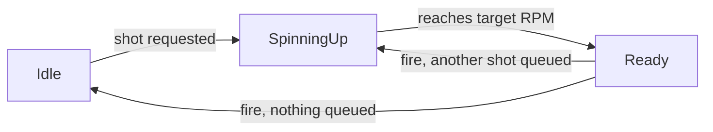

# 04 - Documentation

## Two Distinct SKills

Most people only think about documentation as something you *write*. It's really two separate skills: **writing** docs that help the next reader and **reading** docs efficiently. Both are learnable, and neither is about writing or reading *more*. Good documentation is about finding the smallest amount of text that actually answers the question someone has.

## Writing: READMEs

A README's job is to answer three questions, in order, for someone who has never seen this project before: **what is this**, **how do I set it up**, and **how do I use it**. Implementation detail — what a specific method does internally, line by line — belongs in the code itself (ideally through good naming, per `02_code_organization_modularization`), not the README. You've already seen good READMEs without necessarily noticing them: every primer folder in this curriculum, including this one, follows the same shape — an opening paragraph on what the folder is and how it relates to its siblings, a directory structure, and setup notes.

## Writing: Docstrings and Comments

Every language has its own syntax for attaching documentation directly to code, meant to be read either inline or pulled up by tooling (an IDE's hover tooltip, a generated API reference):

```java
/**
 * Computes how long the flywheel needs to spin up from rest.
 * @param accelerationRpmPerSecond how fast the flywheel gains speed
 * @return spin-up time in seconds
 */
double computeSpinUpTime(double accelerationRpmPerSecond) { ... }
```

```python
def compute_spin_up_time(acceleration_rpm_per_second):
    """Compute how long the flywheel needs to spin up from rest, in seconds."""
    ...
```

```cpp
/// Computes how long the flywheel needs to spin up from rest, in seconds.
double computeSpinUpTime(double accelerationRpmPerSecond) { ... }
```

The syntax (Javadoc, a Python docstring, Doxygen-style `///`) differs, but the job is identical in every language: document what a function promises to its caller — its inputs, its output, any conditions that matter — so someone can use it correctly without reading its body.

## When *Not* to Comment

This is the part people get backwards. **A comment's job is to explain *why*, not *what*.** The code already says what it does, assuming it's named well — a comment that just restates the line below it in English is noise, not documentation:

```python
# increment the counter
count = count + 1
```

That comment adds nothing `count = count + 1` didn't already tell you. Compare it to a comment that earns its place:

```python
# Season rule: a cycle only counts once the robot has fully left the loading zone,
# so we can't just increment on pickup -- see FRC 2026 manual section 9.4.2.
count = count + 1
```

The second comment tells you something the code *can't* tell you on its own: a rule from outside the code that explains why this line exists at all. Save comments for the things a rename can't capture: why a value was chosen, a rule from outside the codebase, a workaround for a specific bug, a warning about something non-obvious that will bite the next person.

## Writing: When a Diagram Beats Prose

Not every fact belongs in a sentence. A diagram is documentation too, and sometimes it says in one picture what would otherwise take several sentences of "first this happens, then that, and if X then Y instead" to describe accurately. A shooter's states are a good test case:

> Idle until a shot is requested, then it spins up. Once it reaches target RPM it's ready to fire. After firing, if another shot is queued it goes back to spinning up; otherwise it returns to idle.



Same four facts, but the diagram is the faster read, because it's actually a diagram-shaped fact — states and transitions between them — not a linear sequence. This curriculum uses this same judgment call throughout: `06_debugging_methodology`'s five-step loop and `07_testing_philosophy`'s test pyramid are both drawn, not just described, because both are shaped like a diagram (a cycle with a branch, a stack with proportions) more than they're shaped like a paragraph. The skill isn't "add diagrams" — one for something genuinely linear just adds a picture that redraws what the prose already said cleanly. It's noticing when the *shape* of what you're documenting is the thing actually worth showing.

## Reading: Navigating Documentation You Didn't Write

Reading documentation efficiently is its own skill, separate from writing it. A few tips: 

- **Look for a quickstart or usage example before the full reference.** Most good documentation (MDN, WPILib's docs, a library's own README) leads with a short example that gets you running, before the exhaustive page-by-page reference.
- **Use in-page search (Ctrl+F/Cmd+F) instead of scrolling.** You're not trying to read the whole page. Focus on finding what you need. 
- **Read a function's signature before its prose description.** The parameters and return type often answer your question faster than a paragraph explaining it.
- **Check the version.** Documentation for the wrong version of a library is worse than no documentation, because it looks right and is subtly wrong. Confirm you're looking at docs for the version you actually have installed.

You'll use this constantly with the references already woven through this curriculum; MDN in `front_end_resources/web_fundamentals_primer`, the WPILib docs in `back_end_resources/systems_primer` and `back_end_resources/language_primer`, Python's own standard library docs.

## Putting it together

Open `examples/ShooterConfig.java`; every comment in it is a "what" comment, restating code that's already clear, and the one place a genuine *why* comment is actually needed (why the flywheel RPM constant is set to the exact value it is) has no comment at all. Then open `examples/messy_README.md`, which is a real project description with real information buried inside a single wall of text, no structure, and implementation detail where usage instructions should be. Both go to `exercises/`, alongside `exercise-3-read-the-real-docs.md`, which picks up the reading half of this module directly against real WPILib documentation instead of a made-up example.

## See also

- **`02_code_organization_modularization`** — naming as documentation, and the specific claim that a "what" comment is a sign a rename is overdue, both picked up in this module.
- **`10_reading_unfamiliar_code`** — reading documentation efficiently is one tool you'll reach for constantly when orienting in a codebase you didn't write.
- **`06_debugging_methodology`** — its five-step loop diagram is the worked example this module's "when a diagram beats prose" section points to directly.

## Resources

- [MDN Web Docs](https://developer.mozilla.org/en-US/) - the reference this curriculum already points you to for HTML/CSS/JS; a good place to practice the "find the one thing, don't read cover to cover" skill.
- [Google Python Style Guide](https://google.github.io/styleguide/pyguide.html) - see the "Comments and Docstrings" section for a real, widely-used style guide's take on exactly the "what vs. why" boundary this module teaches.
- [WPILib Docs](https://docs.wpilib.org/en/stable/) - the same reference already used throughout `back_end_resources/systems_primer` and `back_end_resources/language_primer`; good practice ground for the "quickstart before full reference" reading habit.
