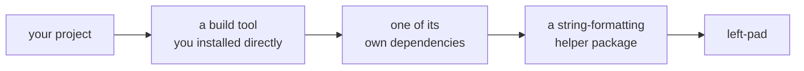

# 05 - Dependency Management

## Dependencies: Code You Use, But Didn't Write

The moment you `pip install` or `npm install` something, you take on the functionality you wanted, but also every bug, security issue, and future breaking change that library's author ever introduces. That's not a reason to avoid dependencies — reimplementing `numpy` or `react` yourself would be awful — but it is why "just add the package" is a real engineering decision, not a free action. This module covers the three things that decision actually depends on: how versions communicate risk, how lockfiles pin down what "install this project" even means, and when the right call is to *not* add a dependency at all.

## Semantic Versioning (semver)

Most published packages follow **`MAJOR.MINOR.PATCH`** (e.g. `2.4.1`), and each number is a promise about what changed:

- **PATCH** (`2.4.1` -> `2.4.2`) — bug fixes only. Should be safe to take automatically.
- **MINOR** (`2.4.1` -> `2.5.0`) — new functionality was added, but nothing that already worked should break.
- **MAJOR** (`2.4.1` -> `3.0.0`) — something that used to work might not anymore. Read the changelog before upgrading.

Package managers let you express how much of that you're willing to accept automatically. In `npm`'s `package.json`, `^2.4.1` means "any version that doesn't bump MAJOR" (safe minor/patch updates allowed), `~2.4.1` means "any version that doesn't bump MINOR either" (patches only), and a bare `2.4.1` means exactly that version, nothing else. Python's `pip` uses a similar idea with different symbols: `pandas>=2.0,<3.0` allows any 2.x release, `pandas==2.1.4` pins exactly one. Whichever ecosystem you're in, the tradeoff is the same one. A wider range gets you fixes automatically but risks an unexpected breaking change; a narrower pin is predictable but goes stale, silently missing fixes, unless someone deliberately revisits it.

Exactly what each range actually permits, against a few real version numbers:

| | `2.4.1` | `2.4.2` | `2.5.0` | `3.0.0` | `3.0.1` |
|---|---|---|---|---|---|
| `^2.4.1` | ✓ | ✓ | ✓ | — | — |
| `~2.4.1` | ✓ | ✓ | — | — | — |
| `2.4.1` (exact) | ✓ | — | — | — | — |

Every row starts at the same place and stops at a different point — `^` stops at the next MAJOR, `~` stops at the next MINOR, and an exact pin never moves at all.

## Lockfiles

A manifest (`package.json`, `requirements.txt`, a Gradle `build.gradle`) says what you *want* — "give me some 2.x version of pandas." It does **not** always say which exact version (because you might not know), and it says nothing at all about **transitive dependencies**, which are the dependencies of your dependencies. A **lockfile** (`package-lock.json`, `poetry.lock`, a resolved Gradle dependency lock) records the *exact*, fully-resolved version of every single package — direct and transitive — that was actually installed the last time someone ran the installer successfully. That's the entire reason lockfiles exist: without one, "it works on my machine" can be true purely because your machine happened to resolve a different transitive version than someone else's did, on the exact same manifest. This is `08_reproducibility`'s subject from the dependency side specifically.

## Transitive Risk: left-pad 

In 2016, an npm package called `left-pad` — eleven lines of code that padded a string with leading characters — was unpublished by its author over an unrelated dispute. Thousands of projects, including some at major companies, broke immediately, because `left-pad` was a *transitive* dependency buried several layers deep in packages they depended on directly, and none of them had ever consciously decided to depend on it at all. Nobody who broke that day chose to trust `left-pad`'s author; they chose to trust some other package, which chose to trust another, which happened to trust `left-pad`. It was like taking information that a friend heard from a friend who heard it from another friend, and treating it like fact. 



Only the first arrow was ever a decision you made. Every arrow after it was someone else's call, made on your behalf, without you ever seeing the name `left-pad` until the day it broke.

Every dependency you add is also every dependency *it* depends on, recursively, whether you ever look at that list or not.

## Judgement Call: Should This Be a Dependency? 

Before adding a package, it's worth actually asking:

- **How much code would this replace?** A well-tested library saving you from a genuinely hard, easy-to-get-wrong problem (cryptography, date/timezone handling, a parser for a real file format) is usually worth it. A package that exists to wrap a single, obvious one-liner (padding a number with zeros, checking if a string is empty) usually isn't, because you're accepting a whole dependency's worth of risk for something `str(n).zfill(3)` already does.
- **How maintained is it?** A package with recent commits, responsive maintainers, and wide adoption is a safer bet than one last updated years ago with a handful of downloads.
- **What does it pull in transitively?** A "small" package that drags in forty other packages behind it isn't small. Be sure to check this out before installing. 

None of these have a formula, unfortunately. They're judgment calls! 

## The Mechanics

Here's some example of real world tools: 

**Python — `pip` and virtual environments.** A **virtual environment** is an isolated folder holding one project's own installed packages, separate from your system's Python and every other project's environment. Without one, installing one project's dependencies can silently break another's. `python -m venv .venv` creates one; `source .venv/bin/activate` (Mac/Linux) or `.venv\Scripts\Activate.ps1` (Windows) switches your shell into it; `pip install <package>` installs into whichever environment is currently active; `pip freeze > requirements.txt` writes down the exact versions currently installed, which is `pip`'s closest equivalent to a lockfile — "closest," because it's really just a flat list of whatever happened to end up installed, not a verified, hash-checked resolution.

A newer tool, **`uv`**, closes exactly that gap, and is fast becoming the ecosystem default for new Python projects: it replaces `pip`, `venv`, and several other tools at once, and `uv add <package>` produces a real lockfile (`uv.lock`). This is the exact, fully-resolved, hash-verified set of every direct *and* transitive package, the genuine thing `pip freeze` was only ever approximating. `uv sync` then installs an environment that matches it precisely, on any machine.

**JavaScript/TypeScript — `npm`.** `package.json` is the manifest. Your direct dependencies and their version ranges, split into `dependencies` (needed to run the project) and `devDependencies` (needed only to build/test it, like a linter or test runner). `npm install` reads it and produces (or updates) `package-lock.json`, the real lockfile, then installs everything into `node_modules/`, a folder you never edit by hand and never need to fully understand the contents of.

**Java — Maven/Gradle.** Java's build tools (Maven's `pom.xml`, Gradle's `build.gradle`, the one WPILib projects actually use) work the same way conceptually: a declarative block listing dependencies and version ranges, resolved against a central repository (Maven Central), with the build tool handling the transitive resolution for you.

```groovy
dependencies {
    implementation "com.google.code.gson:gson:2.10.1"
    testImplementation "org.junit.jupiter:junit-jupiter:5.10.0"
}
```

`implementation` vs. `testImplementation` is the exact same `dependencies`/`devDependencies` split from the `npm` paragraph above, just under different names; running `./gradlew build` is what actually triggers resolution, the same job `pip install`/`npm install` do in the other two ecosystems. The syntax differs from `pip`/`npm`, but you're reading and reasoning about the exact same three things: a manifest, a version range, and a resolved dependency tree.

**C++ — vcpkg and Conan.** Unlike the other three ecosystems, C++ never settled on one standard package manager. **vcpkg** (Microsoft-maintained) and **Conan** are the two most widely used today, and both solve the same problem C++ has always made painful: finding, building, and linking a library your code depends on, instead of vendoring source files by hand or hoping a system-wide install already exists. `vcpkg install <package>` fetches and builds a library for your platform; a manifest file (`vcpkg.json`) plays the same role `package.json`/`requirements.txt` do elsewhere. FRC's own C++ projects mostly sidestep this specific problem: WPILib's vendor-library system runs through the same GradleRIO/Gradle mechanism the Java paragraph above already covers, not a general-purpose C++ package manager. `vcpkg`/`Conan` are what you'd reach for on C++ work outside that specific context.

## Secrets & Credentials

An API key or a password is a special kind of dependency risk. It's not code someone else wrote, it's a credential that grants access, and it's just as easy to accidentally install into your project as a package is. Once you commit a secret and push it, it's compromised for good, even if you delete the line in a later commit: `git` keeps history, so the old commit containing the real value is still sitting there, recoverable by anyone with access to the repo. Deleting the line doesn't undo that; the only real fix once a secret has been pushed is rotating or revoking the credential itself, so the leaked value stops working.

The practice that avoids needing that fix in the first place: never write a real secret directly into a file `git` tracks. Read it from an **environment variable** instead — `os.environ["TBA_API_KEY"]` in Python, `process.env.TBA_API_KEY` in JavaScript/TypeScript — set locally with `export` (`01_shell_cli_literacy`) or via a local `.env` file that's listed in `.gitignore` and never committed. Only a `.env.example` file gets committed, listing the variable *names* your project needs with placeholder values (`TBA_API_KEY=your-key-here`), so a teammate setting up the project knows exactly what to provide without ever seeing a real value:

```python
# Before: the secret lives in tracked source code, permanently, from the moment it's committed
API_KEY = "tba_live_9f8a2c3d4e5f"
```

```python
# After: the secret lives outside the repo entirely
API_KEY = os.environ["TBA_API_KEY"]
```

`git_resources/CONTRIBUTING.md`'s PR checklist already has a line for this — "double check you haven't committed anything that shouldn't be shared" — which is the mechanical, catch-it-before-merge version of this idea. This section is the practice that's meant to make that checklist item a formality nobody ever actually trips, instead of the thing that saves you under deadline pressure.

## Putting it Together

Open `examples/scouting_tool/`. This has a small project's `requirements.txt` and the one script that uses it. Some lines are pinned in ways that will cause real problems; one dependency exists to replace a single line of code you could write yourself in under a minute. A third file, `tba_client.py`, has a different problem entirely; a real-shaped credential sitting directly in tracked source code. Diagnose each one in `exercises/`, then work through `exercise-4-watch-the-lockfile-grow.md` separately — it doesn't use `examples/scouting_tool/` at all, since it's about generating a real lockfile yourself and watching transitive dependencies show up in it uninvited.

## See also

- **`08_reproducibility`** — lockfiles, pinning, and "works on my machine" are largely the same problem, viewed from two different modules.
- **`09_refactoring_technical_debt`** — an unmaintained or unnecessary dependency you decide to remove later is exactly the kind of debt that module covers.
- **`back_end_resources/language_primer`**'s setup notes already have you running `pip install` and `npm install` in practice — this module is where those commands actually get explained.
- **`git_resources/git_primer/08-tags-worktrees-and-releases.md`** — a semver tag is how the version number described above becomes something you can actually `git checkout` back to, instead of just a number in a changelog.
- **`01_shell_cli_literacy`** — the `export`/environment-variable mechanics this module's secrets section relies on directly.
- **`git_resources/CONTRIBUTING.md`** — the PR checklist's mechanical secrets check this section's practice is designed to make almost never trigger.

## Resources

- [Semantic Versioning 2.0.0](https://semver.org/) - the official semver specification, in full.
- [npm Docs: About package.json](https://docs.npmjs.com/cli/v10/configuring-npm/package-json) - the real reference for the manifest format described above.
- [The npm "left-pad" incident, explained (Wikipedia)](https://en.wikipedia.org/wiki/Npm_left-pad_incident) - the full story behind this module's transitive-risk example.
- [uv Documentation](https://docs.astral.sh/uv/) - the official docs for the tool described above; a good place to see the full `init`/`add`/`sync` workflow beyond this module's summary.
