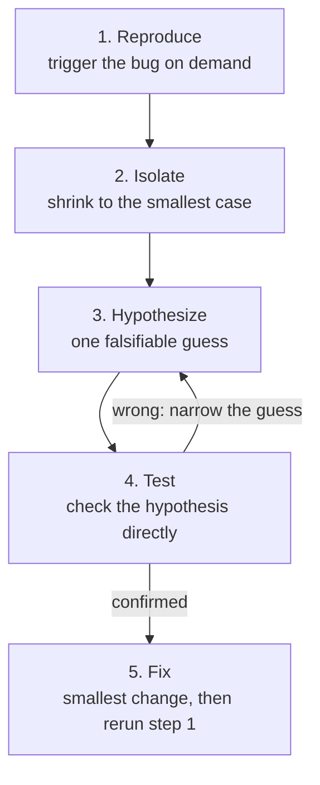

# 06 - Debugging Methodology

## Debugging as a Method

The most common way to debug badly is to change something, rerun, see if the symptom went away; it's a "pie in the sky" way of doing things. This sometimes "works," in the sense that the symptom eventually disappears, but it frequently leaves the actual bug in place, hidden behind a second bug that happens to cancel it out, or "fixed" in a way nobody can explain later. This module is a repeatable method that replaces guessing with a sequence of falsifiable steps; separately, it has the mechanics of the tools (`pdb`, browser DevTools, an IDE debugger) that make the method easier to carry out.

## Five Step Loop 

1. **Reproduce.** Find a reliable way to trigger the bug on demand. If you can't make it happen consistently, you have no way to confirm later that you actually fixed it, rather than got lucky once.
   
2. **Isolate.** Shrink the problem to the smallest case that still shows the bug. This could be the fewest lines, the smallest input, the fewest steps. Much easier to find a bug when you're dealing with less code. 
   
3. **Hypothesize.** State one specific, falsifiable guess about the cause. Go beyond "something's wrong with the loop," with something like "the loop includes the last element twice because the upper bound should be exclusive."
   
4. **Test.** Check the above hypothesis directly — print the value, inspect it in a debugger, add an assertion — instead of staring at the code and reasoning about what it *probably* does. A lot of the times your issue is that code isn't doing what it looks like it does. 
   
5. **Fix.** Make the smallest change that addresses the *confirmed* cause, then rerun your step-1 reproduction case to confirm it's actually resolved.

If a hypothesis turns out wrong in step 4, that's not a failure. Go back to step 3 with a narrower, better-informed guess. This loop is meant to be run several times in a row on a stubborn bug, not completed in one pass.



## Reading Stack Traces

A stack trace is a map of exactly which function called which other function, all the way down to wherever the program actually failed. It's one of the most useful debugging tools you have, and it's most useful once you know how to read it instead of reflexively scrolling past it.

**Python** prints frames top to bottom in call order, with the actual exception type and message *last*, at the very bottom:

```text
Traceback (most recent call last):
  File "scouting_report.py", line 27, in <module>
    report = build_report(team_lookup, entries)
  File "scouting_report.py", line 12, in build_report
    lines = [format_scouting_entry(team_lookup, e) for e in entries]
  File "scouting_report.py", line 7, in format_scouting_entry
    name = get_team_name(team_lookup, team_number)
  File "scouting_report.py", line 2, in get_team_name
    return team_lookup[team_number]
KeyError: 254
```

Read Python tracebacks **bottom-up**: start at the exception type and message (`KeyError: 254`), then walk upward through the call chain (`get_team_name` -> `format_scouting_entry` -> `build_report` -> the `main` block) to see exactly how execution got there. 

**Java** conventions put the exception type and message *first*, with the call chain below it, innermost call first, so read Java stack traces **top-down** instead. `examples/stack_trace_bug/ScoutingReport.java` is the same bug, translated into a genuinely Java-shaped mistake instead of a direct port: `Map<String, String>.get(Object)` accepts *any* `Object` as its key — not just `String` — so passing an `int` where a `String` team number was expected compiles without complaint and simply returns `null` at runtime, instead of throwing where the lookup actually happened.

```text
Exception in thread "main" java.lang.NullPointerException: Cannot invoke "String.toUpperCase()" because "name" is null
	at ScoutingReport.formatEntry(ScoutingReport.java:16)
	at ScoutingReport.main(ScoutingReport.java:11)
```

Same lesson as Python, from the opposite reading direction: the message tells you immediately what broke (`name` was `null`) and where (`formatEntry`, line 16), but the actual mistake, an `int` team number passed where a `String` key belonged, happened two calls earlier, back at the `formatEntry(teamLookup, 254, ...)` call in `main`. The line an exception is thrown from is almost never the same thing as the line that caused it, in any language.

**C++ doesn't give you a stack trace for free at all.** An uncaught exception or a segfault doesn't automatically print a call chain the way Python and Java do; you need a debugger attached to see one. `examples/stack_trace_bug/scouting_report.cpp` has the same shape of bug once more (this time a formatting mismatch — `"0254"` instead of `"254"` — misses the lookup, returning a null pointer that crashes two calls later), and `lldb`'s `bt` command is how you'd actually see where, real output included:

```text
* thread #1, stop reason = EXC_BAD_ACCESS (code=1, address=0x17)
    frame #0: ...basic_string<...>::__is_long(...) at string:2095
    frame #1: ...basic_string<...>::__get_pointer(...) at string:2236
    frame #2: ...basic_string<...>::data(...) at string:1770
    ...two more frames inside libc++'s own <string> implementation...
    frame #5: formatEntry(teamLookup=size=2, teamNumber="0254", notes="Consistently high scoring") at scouting_report.cpp:15
    frame #6: main at scouting_report.cpp:24
```

This is the exact same "skip past frames you didn't write" habit from the Java and Python examples above, just more necessary here: the first several frames are entirely inside the C++ standard library's own `std::string` implementation, and the two that actually matter — `formatEntry`, `main` — are sitting at the bottom, in your own file, exactly where the same instinct says to look.

## Bisection

Sometimes you don't have a single crash to chase. Checking every change one at a time, in order, is the slow way to find it. **Bisection** (binary search applied to debugging) is much faster: check the *middle* of the range between "known good" and "known bad," and let the result cut the remaining search space in half every time, exactly the way you'd search a sorted list. Git has this built in directly; `git bisect` walks you through this process across your commit history, and `git bisect run` can even automate it against a test script (see `git_resources/git_primer/07-exploring-history.md` for the actual command). You don't need git to use the underlying idea; commenting out the second half of a long function to see if a bug persists in the first half alone is the same technique.

## Debuggers

- **Python — `pdb`.** Insert `breakpoint()` directly in your code (or run `python3 -m pdb your_script.py`) and execution pauses there, dropping you into an interactive prompt. The commands you'll use constantly: `n` (next line), `s` (step into a function call), `c` (continue until the next breakpoint or the program ends), `p <expr>` (print a value), `l` (list the surrounding code).
- **Browser — DevTools.** Open DevTools (F12, or right-click -> Inspect) and go to the **Sources** panel. Click a line number to set a breakpoint directly in your actual running JavaScript; when execution hits it, you get the same kind of pause-and-inspect access `pdb` gives you, plus a live **Console** to evaluate expressions in the paused context.
- **Java — an IDE debugger, e.g. VS Code.** Unlike `pdb`, Java debugging is almost always done through an IDE (IntelliJ, VS Code with the Java extension) rather than a standalone command-line tool. In VS Code specifically: click just left of a line number to drop a red breakpoint dot, then press `F5` (or the green "Run and Debug" arrow) instead of a plain run — execution pauses at your breakpoint, and a **Debug** sidebar opens with a **Variables** panel (everything in scope, live), a **Watch** panel (expressions you pin yourself), and a **Call Stack** panel (the same frame-by-frame chain a printed stack trace shows, except clickable. Select any frame to inspect what that specific call believed at the time). A floating toolbar gives you step-over/step-into/step-out/continue, the same four moves `pdb`'s `n`/`s`/`c` give you from a prompt, and the **Debug Console** at the bottom lets you evaluate an expression in the paused context, same job as `pdb`'s `p`. This is enough to start.

All three are the same idea: pause execution at a specific line, look at what the program actually believes right now, and step forward one line (or one function call) at a time until reality stops matching your expectation.

## Putting it Together

Two separate exercises practice two separate halves of this module: `examples/stack_trace_bug/` is a real crash with a real traceback to read and fix using the five-step loop. Pick Python, Java, or C++, or work through more than one to see the same lesson survive the trip across languages; `examples/bisect_the_regression/` is a function that quietly broke several revisions ago, for you to find using bisection instead of checking every version one at a time.

## See also

- **`01_shell_cli_literacy`** — reading a traceback in a terminal and running `python3 -m pdb` both assume the comfort this module treats as a soft prerequisite.
- **`back_end_resources/systems_primer/06_testing_debugging`** — that module is about *catching* bugs before they ever happen, through unit tests and simulation. This module is about what you do once one has already happened.
- **`07_testing_philosophy`** — a good test suite is frequently what tells you a bug exists in the first place, and turns "isolate" (step 2, above) into something close to automatic.
- **`git_resources/git_primer/07-exploring-history.md`** — the real `git bisect` command this module's bisection section is modeled on.
- **`19_postmortems_and_incident_review`** — once the loop above finds and fixes a bug, this is what happens next: writing down why it happened so the same failure doesn't recur.
- **`04_documentation`** — the five-step loop diagram above is that module's own worked example of when a diagram documents something better than prose.

## Resources

- [Python docs: pdb — The Python Debugger](https://docs.python.org/3/library/pdb.html) - the official reference for every `pdb` command mentioned above.
- [Chrome DevTools: Debug JavaScript](https://developer.chrome.com/docs/devtools/javascript/) - the official walkthrough of the Sources-panel breakpoint workflow described above.
- [git bisect documentation](https://git-scm.com/docs/git-bisect) - the real command this module's bisection technique is based on.
- [VS Code: Debugging](https://code.visualstudio.com/docs/debugtest/debugging) - the official reference for the Variables/Watch/Call Stack panels and breakpoint workflow described above, in full.
