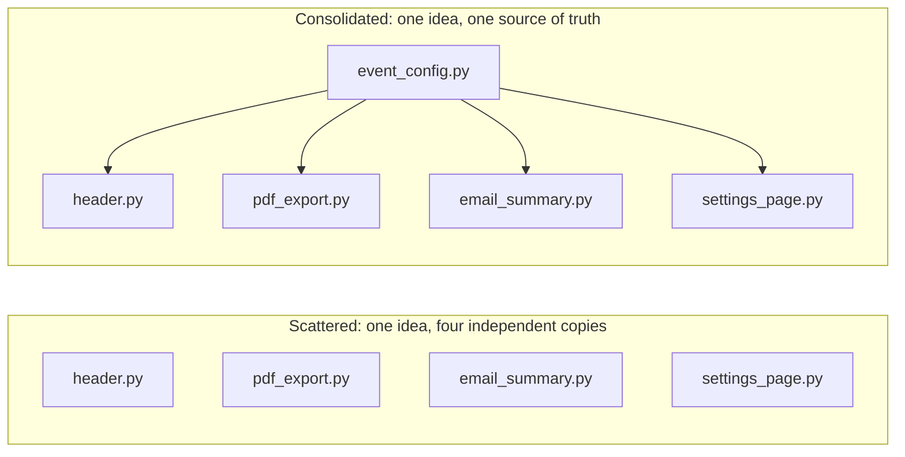

# 09 - Refactoring & Technical Debt

## Debt is a Tradeoff

**Technical debt** is an acknowledgement that there is a gap between building quickly and building the cleanest solution. Sometimes, you building the cleanest solution doesn't make sense. Shipping a slightly messy solution on purpose, soon before a competition, because it works and there's no time left to do better, is a legitimate engineering decision. Debt becomes dangerous when you don't know you're building a messy solution, and bad code becomes your foundation. This module is about recognizing when code has drifted into that second situation, and how to fix it without breaking what already works.

## Recognizing Code Smells

A **code smell** isn't a bug — the code still runs — it's a pattern that tends to predict a *real* problem showing up later. A few of the most common ones:

- **Duplicated code** — the same logic, copy-pasted in two or more places. The danger isn't the extra typing, it's that duplicates drift when someone only changes one version, and now they behave differently. 
- **Long / "god" functions** — a function doing too many unrelated things at once. You've already seen and fixed this exact smell in `02_code_organization_modularization`.
- **Shotgun surgery** — one conceptual change (e.g., "rename this constant") requires editing a dozen scattered files. Usually a sign related things aren't grouped together the way `03_file_project_structure` describes.
- **Long parameter lists** — a function needing six or seven arguments to do its job is usually a sign several of them belong bundled together as one object instead.
- **Dead code** — code that no longer runs or matters, left in "just in case." You've already seen this exact smell too, in `03_file_project_structure`'s stale `old_main_v2.py`.

None of these are inherently going to create bugs, but they are things worth investigating. 

Shotgun surgery specifically is easiest to spot as a shape, not a sentence:

On the left, changing the event name means finding and editing all four files yourself, correctly, every time; missing one means thigns go wrong. On the right, changing it means editing `event_config.py` once; the other four files were never wrong to begin with, because they never had their own copy of the answer.

## Refactoring

**Refactoring** means changing code's internal structure without changing its external behavior — same inputs still produce the same outputs, just organized more clearly. The way to do this safely:

1. **Change one thing at a time.** Fix one smell, not five at once. This way, if something breaks, you know exactly what caused it. 
2. **Verify behavior after every step**, not just at the end. Run the code, and/or its tests, after each small change, not after a large batch of them.
3. **Never refactor and add a feature in the same change.** Separate cleaning up code with changing behavior. Again, if something breaks, you want to know exactly why. 
4. **Use version control as your safety net.** Commit each small, verified step separately (see `git_resources`). If/when later steps break, you want to be able to go back to working code. 

## When Debt is Fine

Debt taken on **deliberately** (e.g., a `TODO` comment with a plan) is manageable. Sometimes, we will end the season with debt still active, and that is not necessarily a bad thing. The real skill is figuring out which debt was actually intentional, vs. bad debt that accumulated and prevents us from building a strong foundation. 

## Putting it Together

Open `examples/scouting_summary.py`. You have two functions that are almost entirely duplicated code, with one detail that quietly drifted between the two copies along the way. Run it once as-is, then refactor it in `exercises/exercise-1-unify-the-duplicates.md`. `exercise-2-shotgun-and-long-lists.md` picks up the other two smells this section names but doesn't yet exercise: `examples/shotgun_surgery/` has one idea (an event name) copied across four files, with one copy already quietly out of sync; `examples/long_parameter_list/` has a real bug hiding in a seven-argument function call, caused by nothing more than two same-typed arguments sitting next to each other.

## See also

- **`02_code_organization_modularization`** — the single-responsibility/naming refactor you already did there is the same underlying skill this module names and generalizes.
- **`03_file_project_structure`** — the stale file and structural cleanup from that exercise are both examples of the debt/smells this module gives names to.
- **`07_testing_philosophy`** — a real test suite is what makes step 2 of "refactoring incrementally" (verify behavior after every step) fast and reliable instead of manual and error-prone.
- **`git_resources`** — small, separately committed refactoring steps as the safety net described above.
- **`14_building_with_intent`** — the mirror-image failure mode: this module is under-building (debt); `14` is over-building (speculative generality), from the opposite direction.

## Resources

- [Refactoring.Guru: Code Smells](https://refactoring.guru/refactoring/smells) - a fuller catalog of code smells than this module's short list, each with its own typical fix.
- [Martin Fowler: Technical Debt](https://martinfowler.com/bliki/TechnicalDebt.html) - the original "debt" metaphor (Ward Cunningham's), and Fowler's own extension of it, from one of the field's most-cited voices on the topic.
