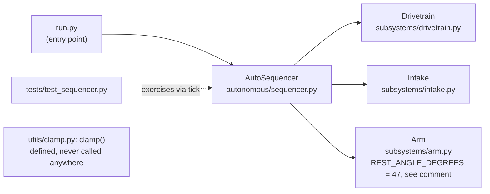

# Exercise 1: Orient in the Codebase

## Goal
Answer every question below about `examples/inherited_robot_code/` before changing a single line of it.

## Scenario
`examples/inherited_robot_code/` is a small, working project with no README and no one around to explain it. Treat it exactly like that: don't open every file top to bottom looking for the answers. Use the orientation strategy from `concept.md` — entry point first, tests first, search before reading linearly — and lean on `01_shell_cli_literacy`'s `ls`, `find`, and `grep` throughout.

## Steps
Answer each question below, and be ready to say *how* you found the answer (which command, or which file), not just what it is.

1. **Entry point:** Which file is this project's entry point? How did you find it without opening every file?
   
2. **Structure:** How many subsystems does this project have, and what are their names? (Don't guess — use `ls`/`find` on `subsystems/`.)
   
3. **Tests:** Which part of the codebase has automated test coverage, and which parts have none at all? Run the existing tests (`python3 run_tests.py`) and confirm they pass.
   
4. **Dead code:** `utils/clamp.py` defines a function called `clamp`. Using `grep -rn "clamp("`, determine: is it actually called anywhere else in the project?
   
5. **Chesterton's Fence:** `subsystems/arm.py` sets `REST_ANGLE_DEGREES = 47`. Before assuming this is an arbitrary number worth rounding to something cleaner, read the comment above it. What does it say, and what would happen if you changed it without understanding why it's there?
   
6. **Behavior:** Without reading `autonomous/sequencer.py` line by line first, run `python3 run.py`. What gets printed, in what order? *Then* open the file and confirm you can explain each line of output from the code.

7. **Sketch it yourself.** Before reading any further — and before looking at the Reflection below — draw or write out your own rough sketch of this project: the entry point, each subsystem, which parts have test coverage and which don't (from step 3), and the dead function you found in step 4. A few boxes and arrows on paper or in a text file is enough; this isn't about making it look nice, it's `concept.md`'s step 5, actually practiced instead of just read about.

## Self-Check
- [ ] I can name the entry point and explain how I found it (not just that I eventually found it)
- [ ] I correctly counted 3 subsystems and named all three
- [ ] I ran the existing tests successfully and can say which parts of the code have zero test coverage
- [ ] I used `grep` to confirm `clamp()` is never called anywhere outside its own definition
- [ ] I can state, in my own words, why `REST_ANGLE_DEGREES` is `47` and why changing it casually would be risky
- [ ] I predicted `run.py`'s output before reading `sequencer.py` line by line, then confirmed my prediction against the actual code
- [ ] I sketched the pieces and their connections myself, before reading the Reflection's version below

## Reflection
Notice you were able to answer every one of these questions — including two (dead code, the arm angle) that would genuinely matter if you were about to make a change — without ever reading the entire codebase start to finish. Orienting yourself is crucial to picking up code and starting off the season in a faster manner.

Compare your own step-7 sketch to this one:

Did yours capture the same gaps this one does, or just the pieces? Notice what the diagram itself tells you, beyond any one answer: `tests/test_sequencer.py` only has an edge into `AutoSequencer`, not into `Drivetrain`, `Intake`, or `Arm` directly; the test coverage gap from step 3 is visible as a *missing* connection, not something you have to remember separately. And `clamp()` sits with no incoming edges at all! Dead code doesn't just fail to run, it fails to connect to anything, which is exactly what made it findable with `grep` in step 4. A sketch this rough took a few minutes and already answers "where would I start, and what would I be careful around" faster than re-reading the whole project would — and if your own sketch missed one of those gaps, that's worth noticing too: it means the gap was invisible to you until you saw it drawn out.
