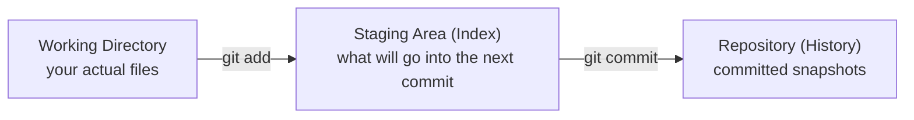

# The Git Mental Model

Most Git confusion comes from a bad mental model, or understanding of how things work. Understanding this is going to be far more important than understanding individual commands. 

## Git is a snapshot database
Each commit is:
- A snapshot of *all tracked files*
- Linked to its parent commit(s)
- Identified by a hash

A hash is a way of marking which commits are which. No need to worry about the specifics of hashing, unless you want to dive deeper into data structures. We cover those (lightly) in `back_end_resources`.

Git does **not** store diffs, or comparisons between different file versions, internally.

## Three main areas
You work in three places:

1. **Working Directory**
   - Your actual files
2. **Staging Area (Index)**
   - What will go into the next commit
3. **Repository (History)**
   - Committed snapshots

Workflow: Working Directory --> Staging Area --> Repository 

## Commits are immutable
Once created, commits themselves don't change. The history of your code only changes as you add in new commits. You may point the commit history to new commits, but any existing commit is still going to stick around. 

This is why Git is safe!

## Branches are pointers
A branch is just a movable pointer to a commit. It is not a copy of the files themselves.

This makes branching cheap and fast. You can think of a branch as an indicator of where you are working. We will explain this more in the branching module. 

## HEAD is a pointer too
`HEAD` is Git's name for "where you currently are". Almost always, it points at whichever branch you have checked out, which in turn points at a commit. When you switch branches, `HEAD` moves to point at the new branch instead. 

You'll see `HEAD` show up constantly: in conflict markers, in commands like `git reset HEAD~1` (go back one commit from here) or `git checkout HEAD -- FILE` (restore a file to its last committed state). It always just means "start counting from wherever I currently am." 

Once you understand commits and pointers, you will feel a lot more comfortable using Git. 

## Resources
- **Official docs:** [Pro Git, Ch. 10.1 - Plumbing and Porcelain](https://git-scm.com/book/en/v2/Git-Internals-Plumbing-and-Porcelain) and [Ch. 10.2 - Git Objects](https://git-scm.com/book/en/v2/Git-Internals-Git-Objects) - how commits, trees, and blobs actually work under the hood.
- **Blog:** [Git for Computer Scientists](https://eagain.net/articles/git-for-computer-scientists/) - a short, sharp explanation of Git's object model as a directed acyclic graph.
- **Blog:** [Think Like (a) Git](https://think-like-a-git.net/) - focused specifically on building the right mental model instead of memorizing commands.
- **Long-form guide:** [Git from the Bottom Up by John Wiegley](https://jwiegley.github.io/git-from-the-bottom-up/) - a deeper, free write-up for anyone who wants to go further than this primer does.
