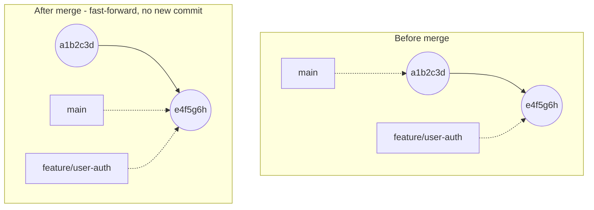
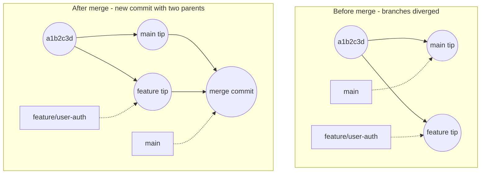
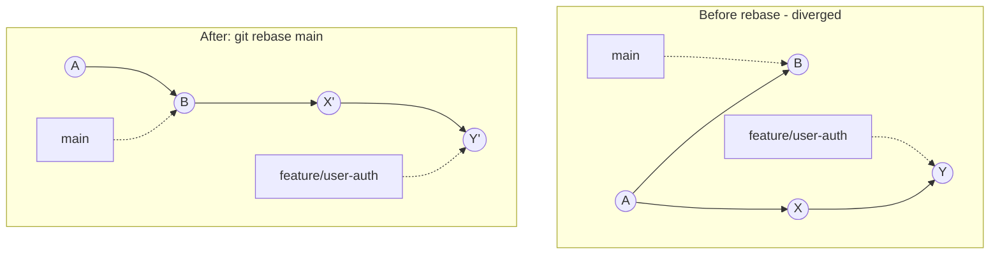

# Merge vs. Rebase: Different Ways of Resolving Remote and Local Changes

OK, so you've made some changes locally. You're finally ready to get those changes on the `main` branch. How do you go about doing this?  

## Merge: Combining Branch History 

With `git merge`, you are essentially combining the commit history of two branches. You aren't erasing any of the previous work; you are simply making sure that the `main` branch has access to your own branch's commits. 

The syntax is straightforward. You first run `git checkout main` to get back to your target branch (or replace `main` with any other target branch you want to merge with): 

```bash
git merge BRANCH_TO_MERGE
```

where the `BRANCH_TO_MERGE` is the branch you were doing work on that you want to merge with the target branch. 

### Fast-Forward vs. Merge Commit

Depending on what's happened on `main` since you branched off, `git merge` does one of two different things. 

**If `main` hasn't changed since you branched off**, Git can just slide the `main` pointer forward to point at your branch's latest commit. Remember from `01-git-mental-model.md`, a branch is just a pointer. No new commit gets created; your commits simply become part of `main`'s history. You'll see output like this: 

```bash
git checkout main
git merge feature/user-auth
```
```bash
Updating a1b2c3d..e4f5g6h
Fast-forward
 src/auth/login.py | 12 ++++++++++--
 1 file changed, 10 insertions(+), 2 deletions(-)
```



`main` simply moves forward to point at the same commit `feature/user-auth` was already pointing at. Nothing new gets created. 

**If `main` *has* moved on** (say a teammate merged something else into `main` while you were working), Git can't just slide the pointer forward anymore because the two branches have diverged. Instead, Git creates a brand new commit that has **two parents**: the tip of `main` and the tip of your branch. You'll see output like this instead: 

```bash
Merge made by the 'ort' strategy.
 src/auth/login.py | 12 ++++++++++--
 1 file changed, 10 insertions(+), 2 deletions(-)
```



Unlike the fast-forward case, a brand-new commit (`mc` above) gets created with two parent edges: one back to `main`'s old tip, one back to `feature/user-auth`'s tip. 

This is why you'll sometimes see a commit in `git log` that reads something like `Merge branch 'feature/user-auth' into main`. That's this merge commit. Both kinds of merges are completely normal; which one happens just depends on whether `main` moved while you weren't looking. 

## Rebase: Rewriting Commit History 

`git merge` preserves history exactly as it happened; two branches diverge, then reconverge with a merge commit tying both together. `git rebase` takes a different approach: it picks up every commit that's unique to your branch and replays them, one at a time, on top of a new base commit. It is as if you'd started your work from there all along. 

```bash
git checkout feature/user-auth
git rebase main
```

This takes every commit on `feature/user-auth` that isn't on `main`, and re-applies them one by one on top of `main`'s current tip. The result *looks* like a clean, linear history - no merge commit, no visible sign your branch ever diverged - because each replayed commit is technically a brand-new commit, with a new hash and a new parent, even though the code changes it introduces are identical to the original. 



Notice `X` became `X'` and `Y` became `Y'`. These are new commits, not the old ones moved. This is exactly why rebase counts as *rewriting* history (`01-git-mental-model.md`): the original `X` and `Y` still exist, immutable, somewhere in Git's database, but nothing on your branch points to them anymore. 

### Resolving Conflicts During a Rebase

Conflicts during a rebase work like the conflicts in `05-resolving-conflicts.md`, with one difference: instead of stopping once, Git can stop **once per replayed commit** that conflicts. At each stop: 

```bash
# fix the conflict in your files, then:
git add path/to/file
git rebase --continue
```

If it gets messier than it's worth, back out entirely with `git rebase --abort`, the same way `05-resolving-conflicts.md` uses `git merge --abort`. 

### When Rebase Makes Sense For Us

Since we work in sub-teams on a defined piece of the robot rather than everyone touching everything, a feature branch is usually only ever seen by you - or the couple of teammates you're actively coordinating with - before it's merged. That's exactly the case where rebase is safe: rewriting history is only risky once *people outside that small circle have already pulled it and built more work on top of it*, which is the same "not yet shared -> safe to rewrite" rule `06-solving-common-issues.md` already uses for `reset`. 

So it's entirely reasonable to rebase your own feature branch onto the latest `main` before opening a PR, instead of merging `main` into it; either one satisfies CONTRIBUTING.md's "merge (or pull) the latest `main` into your branch" step, and rebase gets you a cleaner history for your reviewer to read. If you've already pushed that branch once, rebasing rewrites commits that are now on the remote too, so a plain `git push` will be rejected (`06-solving-common-issues.md`). You have to explicitly force it through: 

```bash
git push --force-with-lease
```

`--force-with-lease` is a safer force-push: it checks that the remote branch hasn't changed since you last fetched it, and refuses to push if it has, which is protecting you or a teammate from silently overwriting commits neither of you has seen yet. Don't use plain `--force` on a branch anyone else might also be pushing to. 

Once your branch is merged into `main`, treat it as shared. Stop rebasing it, and reach for `git revert` instead if something needs undoing (`06-solving-common-issues.md`). 

### A Note on `git pull --rebase`

You'll also see `git pull --rebase` recommended. `06-solving-common-issues.md` mentions it as an option when your own branch has diverged from its own remote copy. Instead of creating a merge commit like a normal `git pull` would, this replays your local commits on top of whatever's newly on the remote, using the same mechanism as above. It's a reasonable default for a branch only you are working on. If a teammate might also be pushing to that exact branch, coordinate with them first, because it rewrites commits you don't necessarily know they haven't already built on. 

## Fetch: Previewing Remote Content

You might only be interested in viewing the remote content without changing your local branches. Running `git fetch` allows you to download remote content to your working directory and you can therefore view any changes manually. 

You likely would be looking at files on the repo website anyway, but this is still useful if you'd rather have files stored locally as well. See `03-branching.md` for how to use `git fetch` together with `git checkout` to grab a remote branch you don't have locally yet. 

## Resources
- **Official docs:** [Pro Git, Ch. 3.2 - Rebasing](https://git-scm.com/book/en/v2/Git-Branching-Rebasing) - the official explanation of what rebase does and when the maintainers themselves recommend it.
- **Official docs:** [git-merge](https://git-scm.com/docs/git-merge), [git-rebase](https://git-scm.com/docs/git-rebase), [git-fetch](https://git-scm.com/docs/git-fetch), [git-push](https://git-scm.com/docs/git-push) (see `--force-with-lease`) - full command references.
- **Blog:** [Merging vs. Rebasing - Atlassian Git Tutorial](https://www.atlassian.com/git/tutorials/merging-vs-rebasing) - a balanced, widely-cited comparison of the two approaches.
