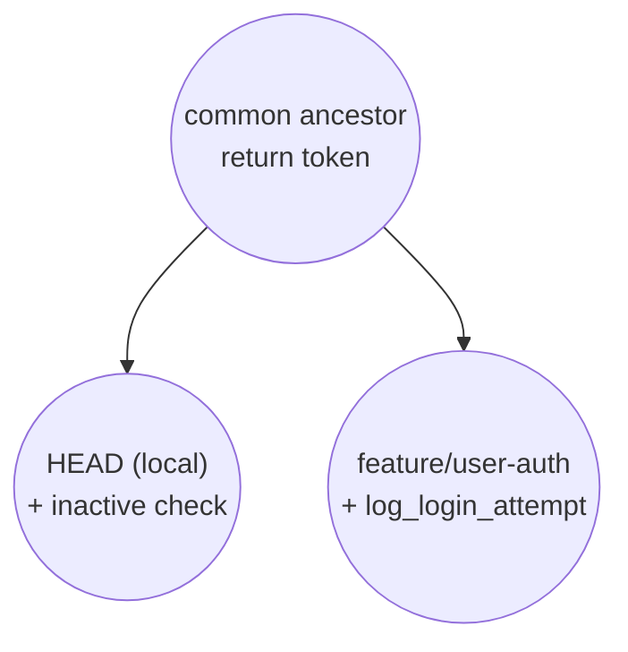

# Resolving (Merge) Conflicts

When you merge branches, there is a good chance that you will run into a message like this: 

```bash
git merge feature/user-auth
Auto-merging src/auth/login.py
CONFLICT (content): Merge conflict in src/auth/login.py
```

What does this mean? This implies that in the `login.py` file, there is a difference in the code in our local branch and the remote branch. Note that the only differences that matter is that when code on one line in the file on one branch is different than the code on that same line in the file on the other branch. To be more specific, if I added new lines of code, there is no merge conflict. However, if I change an existing line of code, there is an issue. 



Both sides edited the *same* line since the common ancestor; that's what makes this a conflict Git can't resolve automatically. If they'd touched different lines instead, Git would have silently auto-merged both edits and you'd never have seen a `CONFLICT` message at all. 

Note that this doesn't only happen with a manually-typed `git merge`. Since `git pull` is really just `git fetch` + `git merge` under the hood (see `02-core-workflow.md`), the exact same `CONFLICT` message can show up the moment you run a routine `git pull` to sync with the remote. Don't panic if that happens. It's the same situation, just triggered a different way, and everything below still applies. 

In this hypothetical example, say I open up `login.py`:

```python
def login(user, password):
<<<<<<< HEAD
    if not user.is_active:
        raise PermissionError("User account is inactive")
    token = generate_token(user)
    return token
======= # above this line is local code, below is remote 
    token = generate_token(user)
    log_login_attempt(user)
    return token
>>>>>>> feature/user-auth
```
So, we can see that our local and remote branches have different versions of this functions. To resolve this, you have to manually edit the file, and then remove all of the conflict markers (`HEAD`, `===`, `>>>`, etc.). 

One possible solution looks like this: 

```python
def login(user, password):
    if not user.is_active:
        raise PermissionError("User account is inactive")
    token = generate_token(user)
    return token
```

Here, we just use our local code and remove the remote code, along with all of the conflict markers (`<<<<<<< HEAD`, `=======`, `>>>>>>> feature/user-auth`). There are many ways to resolve merge conflicts! 

## A Faster Option: Taking One Side Entirely

Sometimes you know upfront that you just want to keep one branch's version of a file completely, conflicts and all, rather than hand-editing it. Instead of manually removing the markers, you can tell Git to take one side outright: 

```bash
git checkout --ours path/to/file    # keep your current branch's version
git checkout --theirs path/to/file  # keep the incoming branch's version
```

Then stage and commit as usual. Be careful with this; it discards the *entire* file from the side you didn't pick, not just the conflicting lines, so it's only appropriate when you're confident one version should fully win. For anything more nuanced, manual editing (like above) is safer. 

Once you've fixed these conflicts, you are free to run `git add` to stage the file, `git commit` to create the commit, and `git pull` to get remote changes and `git push` to get the local changes in the repo.

If your merge is proving very difficult to solve, you can always run `git merge --abort` to cancel the merge and revisit at another time. 

## Resources
- **Official docs:** [Pro Git, Ch. 7.2 - Advanced Merging](https://git-scm.com/book/en/v2/Git-Tools-Advanced-Merging) - covers conflict resolution in more depth, including merge tools.
- **Blog:** [How to Resolve Merge Conflicts in Git - Atlassian Git Tutorial](https://www.atlassian.com/git/tutorials/using-branches/merge-conflicts) - another walkthrough of reading and resolving conflict markers.
- **Research paper:** Ghiotto, G., Murta, L., Barros, M., & van der Hoek, A. (2018). ["On the Nature of Merge Conflicts"](https://leomurta.github.io/papers/ghiotto2018.pdf) - an empirical study of conflicts across 2,731 open-source Java projects.
- **Research paper:** McKee, S., Nelson, N., Sarma, A., & Dig, D. (2017). ["Software Practitioner Perspectives on Merge Conflicts and Resolutions"](https://ieeexplore.ieee.org/document/8094445/) (ICSME 2017) - interviews and a survey on how developers actually approach conflict resolution in practice.
