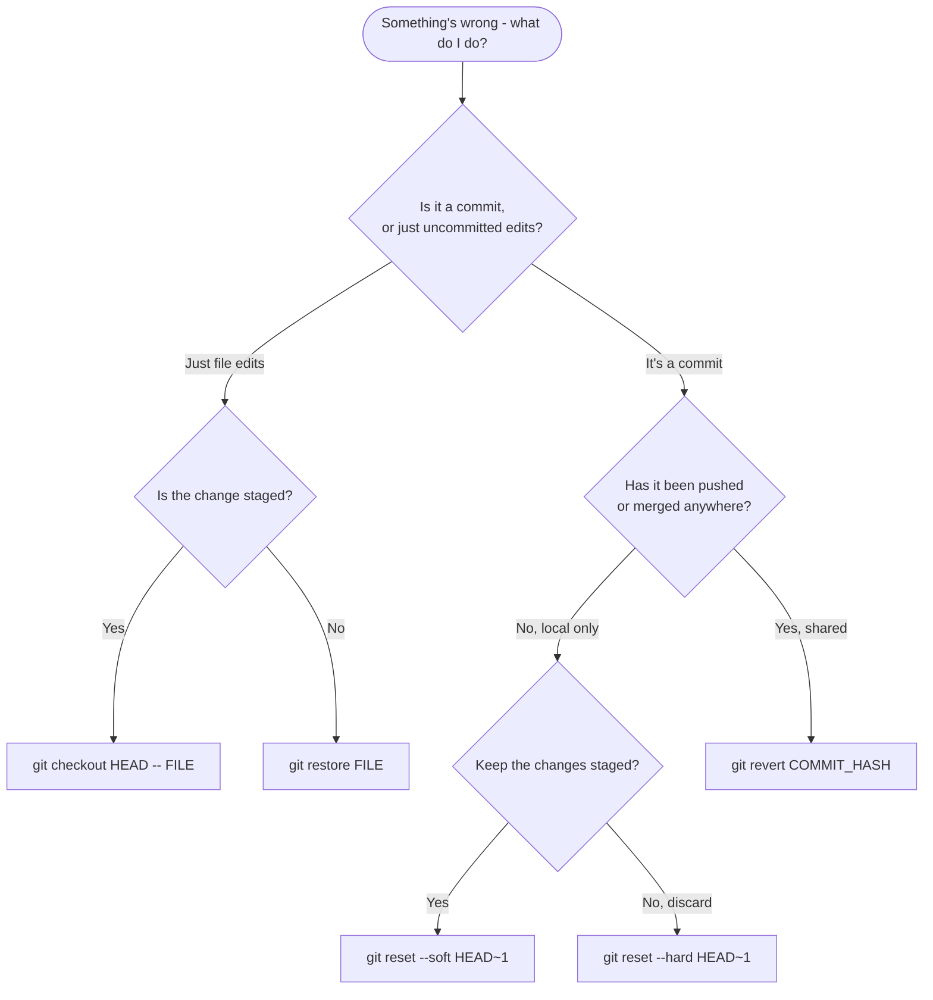

# Solving Common (Git) Issues

It is inevitable that you are going to run into some issues with git. The goal of this file is to give you some starting points of what to try. Remember, you do **not** need to memorize all of this, and you can always look things up for further reference! 

## First Rule: Stop and Check State

Before doing **anything** when running into an issue on git, please be sure to run `git status` so you can see what is going on in terms of committed files, unstaged files, etc. You would be shocked at how many problems you can fix simply by running this command and going from there. 

Once you know what state you're in, here are the two most common forks in the road; the rest of this file covers everything else, section by section: 



## "I Staged the Wrong File!"

Sometimes, you might've run `git add` on files you didn't want to be staged yet. Say, for instance, you accidentally ran `git add secrets.txt`, so now your `git status` call looks like this: 

```bash 
Changes to be committed:
    modified: config.yaml
    modified: secrets.txt
```
To fix this, you can run `git restore --staged secrets.txt` to remove that file from the staging area. Your changes remain local, so nothing wrong with running this to avoid confusing commits! 

## "I Committed Something I Shouldn't Have!"

You can remove commits but keep your changes staged by running `git reset --soft HEAD~1`. 

If you want to also unstage those changes, run `git reset HEAD~1`. 

If you use `git reset --hard HEAD~1`, beware that you would be deleting the most recent commit on your current branch and **ALL** uncommitted changes in the staging and working directory. So try to avoid using this. 

Recall from `01-git-mental-model.md` that `HEAD` points at your current working position, so `HEAD~1` means "one commit before that."

## "I Need to Undo a Commit That's Already Been Pushed!"

Everything in the section above works great for commits that only exist on your own machine. But once a commit has been pushed and is part of shared history (e.g., merged into `main`), rewriting it with `git reset` becomes dangerous, because anyone else who has already pulled that commit will run into a confusing, diverged history. 

For commits that are already shared, use `git revert` instead: 

```bash
git revert COMMIT_HASH
```

Instead of rewriting history, `revert` creates a **brand new commit** that undoes the changes from `COMMIT_HASH`, leaving the original commit in place. History stays intact and linear for everyone else. It just now includes an extra commit that cancels out the bad one. 

Rule of thumb: **your own commits, not yet pushed → `reset`. Shared commits, already pushed → `revert`.**

## "I Need to Change my Last Commit!"

`git commit --amend` will allow you to change a commit message, add more files to the commit, etc. Only use this on your **own personal branches**. 

## "I Need to Unstage Files!"

`git restore --staged .` to unstage all files, `git restore --staged FILE` to unstage a given file. 

## "I Need to Undo Changes to my Files!" 

If the change is staged (or you want to throw away both staged and unstaged edits at once and land exactly back on the last commit), run `git checkout HEAD -- path/to/file`. The `--` is telling you that you are specifying a file (not a commit or branch), and `checkout` is making sure that `HEAD` will include the most recent committed changes of that file. 

If the change is only unstaged (you haven't run `git add` on it), `git restore path/to/file` does the same job, just scoped to your working directory. 

## "I Did Work on the Wrong Branch and now I Can't Find it! 

You can run `git reflog` to get an entire local history of commits. Once you run this, you can see a commit number followed by the commit message, like so: 

```bash 
a1b2c3d HEAD@{2}: commit: WIP login validation
```

That first number tells you the commit hash, which you can think of as an identifier for each commit, and you can revert back to that commit by running `git checkout a1b2c3d`. 

Note that `git log` would give you the entire history of the repository, including the remote branches, so if you are only concerned with work done locally, stick to `git reflog`. 

If you committed work to the wrong branch, you can also retrieve the work like this: 

```bash
git checkout CORRECT-BRANCH
git cherry-pick COMMIT-HASH
```

`git cherry-pick` takes the changes introduced by that one commit and replays them as a new commit on top of whatever branch you currently have checked out. It's a way to copy a single commit from one branch to another without merging everything else.

## "I Committed Straight to `main`!"

It happens! You start typing before creating a branch, and suddenly there's a commit sitting on your local `main` that should've been on its own branch. As long as you haven't pushed it yet, this is easy to fix: move the commit onto a new branch, then rewind `main` back to match the remote. 

First, create a branch at your current position. This doesn't lose anything, it just adds a second pointer to the same commit: 

```bash
git branch feat/my-feature/NAME
```

Now switch back to `main` and reset it to match the remote: 

```bash
git checkout main
git reset --hard origin/main
```

This is one of the few times `git reset --hard` is the right call, because you're resetting `main` back to a known-good state (the remote), not throwing away uncommitted work. Your commit is safe on the branch you just created. Switch there and keep going: 

```bash
git checkout feat/my-feature/NAME
```

If you already pushed the commit to `origin/main`, stop and talk to a lead instead; fixing it at that point means changing a shared branch, and it's worth having a second pair of eyes on that. 

## "I'm in a Detached HEAD State!"

Sometimes, after doing that `git checkout COMMIT_NUMBER`, you will get a message like this after making more changes: 

```bash
You are in 'detached HEAD' state
```

This means that the `HEAD` pointer is no longer referring to a specific branch (like the one you were working on). It could be referring to the specific commit number, for instance. 

A detached HEAD state means that none of your changes will be saved! So, you must create a new branch and switch there: 

```bash 
git checkout -b other/rescue-work/NAME
```

Your commits will then be safe. 

## "I Pushed and Got Rejected!"

You run `git push` and instead of success, you get something like this: 

```bash
git push
 ! [rejected]        feature/user-auth -> feature/user-auth (fetch first)
error: failed to push some refs to 'origin'
hint: Updates were rejected because the remote contains work that you do
hint: not have locally. This is usually caused by another repository
hint: pushing to the same ref.
```

This means the remote branch has commits you don't have locally yet - usually because a teammate pushed to the same branch, or you forgot to `git pull` before starting work. Git is refusing to push because doing so would overwrite that work. 

The fix is almost always to just pull first, then push again: 

```bash
git pull
git push
```

If pulling triggers a merge conflict, that's normal. Resolve it like any other conflict (see `05-resolving-conflicts.md`), then push. 

## "My Branch is Different from Remote!"

If you run `git status`, we already saw in `02-core-workflow.md` that you might need to push if your branch is ahead, and pull if your branch is behind. The 3rd possible issue is that there is a divergent branch issue like this: 

```bash
git status
On branch feature/user-auth
Your branch and 'origin/feature/user-auth' have diverged,
and have 3 and 2 different commits each, respectively.
  (use "git pull" to merge the remote branch into yours)

nothing to commit, working tree clean
```

In this case, you cannot pull or push to fix this issue because you have already brought in any remote changes, and there are no more local changes to commit. You either have to merge, or you can stack commits on top of one another using `git pull --rebase`. Remember that for shared branches using merge is the safer option! 

## "How Can I Store Work for Later?"

Sometimes, you do some work on your working directory, and it is messy, so you can't commit, but you also don't want to start over. You can run `git stash` to store the uncommitted local changes elsewhere, which you can retrieve using `git stash pop`. 

## "How Can I See Differences in Local vs. Remote Branch?"

We mentioned before that you can use `git fetch` to preview files on the remote branch, but sometimes you don't want to download all of those remote files. You can run `git diff` and this will show all of the unstaged changes in the working directory. There are different commands that will show you different parts, like `git diff --staged` showing you the changes in the staging area. 

## "I Committed and Pushed Something Sensitive!"

If you accidentally commit and push a password, API key, or other credential, deleting it in a follow-up commit is **not enough**. It's still sitting in the repository's history, and anyone can dig it out with `git log` or `git show`. 

Two things to do immediately: 

1. **Rotate or invalidate the credential.** Assume it's compromised the moment it's pushed, and get a new one; this matters far more than cleaning up the git history. 
2. **Talk to a lead.** Actually removing a file from history (tools like `git filter-repo` or the BFG Repo-Cleaner) rewrites every commit after it, which is disruptive for anyone else working off that history, so it's worth doing carefully and not solo. 

This is exactly the kind of situation the `.gitignore` guidance in `02-core-workflow.md` is meant to prevent in the first place! 

## Resources
- **Official docs:** [git-reset](https://git-scm.com/docs/git-reset), [git-revert](https://git-scm.com/docs/git-revert), [git-reflog](https://git-scm.com/docs/git-reflog), [git-stash](https://git-scm.com/docs/git-stash) - full command references for everything in this chapter.
- **Blog:** [Undoing Changes - Atlassian Git Tutorial](https://www.atlassian.com/git/tutorials/undoing-changes) - a good side-by-side comparison of `reset`, `revert`, and `checkout`.
- **Troubleshooting guide:** [Oh Shit, Git!?!](https://ohshitgit.com/) (or the profanity-free [Dangit, Git!?!](https://dangitgit.com/en)) - plain-English fixes for almost every mistake covered in this chapter, and then some.
- **Official docs:** [GitHub Docs - Removing Sensitive Data from a Repository](https://docs.github.com/en/authentication/keeping-your-account-and-data-secure/removing-sensitive-data-from-a-repository) - the full process if you ever need to actually scrub a leaked credential from history.
