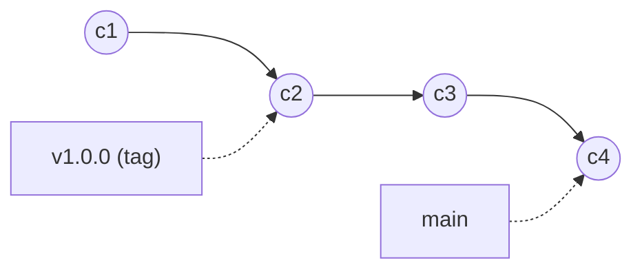

# Tags, Worktrees, and Releases: Building Reproducible Work

`07-exploring-history.md` was about reading history that already exists. This file is about writing history in a way that other people - teammates, future you, or the public if code is ever open-sourced - can rely on. "Reproducible" here means a very concrete thing: someone else can get to the *exact* state of the code you had, on demand, without asking you. 

## Tags: Naming a Point in History

A branch is a pointer that moves every time you commit (`01-git-mental-model.md`). A **tag** is a pointer that doesn't move. It marks one specific commit forever, typically because that commit is a release. 



`main` keeps moving forward with every new commit. `v1.0.0` stays pinned at `c2` forever, and that's what makes a tag a reliable, reproducible reference point, even long after `main` has moved on. 

There are two kinds. A lightweight tag is just a name for a commit: 

```bash
git tag v1.0.0
```

An annotated tag is a real object in Git's database; it stores a message, the tagger's name, and a date, the same way a commit does. For anything you'd actually call a "release," use annotated tags: 

```bash
git tag -a v1.0.0 -m "First competition-ready build"
```

Tags don't get pushed automatically - `git push` only sends commits and branches. Push a tag explicitly: 

```bash
git push origin v1.0.0
```

or push every tag you have locally at once: 

```bash
git push --tags
```

Checking out a tag works like checking out anything else - `git checkout v1.0.0` - but since a tag doesn't move, you land in detached HEAD (`06-solving-common-issues.md`). That's expected: you're not meant to commit on top of a tag, just look at or build from it. 

## Tags and Semantic Versioning

You'll notice the tag examples above (`v1.0.0`) follow the `MAJOR.MINOR.PATCH` pattern. That's semantic versioning, or "semver" - already covered in depth in `general_programming_resources/05_dependency_management/concept.md`. The connection to Git is simple: a semver tag is how a version number becomes something you can actually `git checkout` back to, instead of just a number written in a changelog somewhere. 

## Your Commits Are Already "Conventional Commits"

Look back at `CONTRIBUTING.md`'s commit message format: `<type>(<scope>): <subject>`, with `feat`, `fix`, `test`, `refactor`, and so on as the type. That's not a convention we invented, it's an implementation of [Conventional Commits](https://www.conventionalcommits.org/), a widely-used spec that a lot of real tooling understands. 

Because the type is machine-readable, tools can scan your commit history between two tags and generate a changelog automatically - "here's every `feat` and `fix` since v1.0.0" - without a human writing release notes by hand. GitHub does a version of this itself (the "Generate release notes" button when you draft a release groups PRs by label). Dedicated tools like [semantic-release](https://semantic-release.org/) go further and can even decide your *next* version number automatically: a `fix` bumps the patch version, a `feat` bumps the minor version, and so on. 

None of this requires new effort from you, because it's a direct payoff of following the commit convention you're already asked to follow. 

## Archiving a Release

Sometimes you want to hand someone a clean copy of the code at a given tag or commit - no `.git` folder, no history, just the files, ready to zip up and ship. 

```bash
git archive --format=zip -o release-v1.0.0.zip v1.0.0
```

This is how you'd produce something to attach to a GitHub Release, send to a competition inspector, or archive outside of Git entirely. 

## Signed Commits and Tags (Optional / Advanced)

On serious open-source projects, you'll sometimes see tags or commits marked "Verified" on GitHub. That's a GPG (or SSH) signature; it's cryptographic proof that the commit/tag actually came from the person it claims to, not just someone who set their `git config user.email` to match. This matters a lot for widely-distributed open-source software, where anyone can open a PR and impersonating a maintainer's name is trivial. 

Setting it up (generating a key, registering it with GitHub, configuring Git to sign automatically) is real overhead and not something this team needs day-to-day. It's worth knowing this exists and *why* projects do it, so it doesn't look mysterious the first time you see a "Verified" badge. See GitHub's docs in Resources below if you ever want to set it up yourself. 

## Worktrees: Multiple Branches, Checked Out at Once

Normally, checking out a branch changes the files in your one working directory, since you can only be "on" one branch at a time locally. `git worktree` lets you check out a *second* branch (or tag, or commit) into a separate folder, backed by the same `.git` history, at the same time: 

```bash
git worktree add ../scout-hotfix fix/scout-crash/nick
```

This creates a new folder `../scout-hotfix` with `fix/scout-crash/nick` checked out in it, completely independent of whatever you have checked out in your main folder. Your original working directory is untouched; no stashing, no committing half-finished work just to switch branches. 

This is exactly the reproducibility use case: say a teammate reports a bug that only shows up in `v1.0.0`, but you're mid-feature on `main` and don't want to disturb it. 

```bash
git worktree add ../reproduce-bug v1.0.0
```

Now you have `v1.0.0` checked out in `../reproduce-bug` to poke at, while `main` in your original folder stays exactly as you left it. 

To see what worktrees you have, and to clean one up when you're done: 

```bash
git worktree list
git worktree remove ../reproduce-bug
```

## Putting It Together

Tags, worktrees, and `git archive` are the git-specific pieces of reproducibility: a tag says *what state to reproduce*, a worktree lets you *reproduce it alongside your current work instead of disrupting it*, and `git archive` lets you *hand that state to someone else* as plain files. `general_programming_resources/08_reproducibility/concept.md` covers the rest of the picture - things like seeding your PRNG and reproducible builds - that live outside of what Git itself can guarantee. Between the two, "reproducible" stops being an aspiration and becomes something you can actually do on command. 

## Resources
- **Official docs:** [git-tag](https://git-scm.com/docs/git-tag), [git-worktree](https://git-scm.com/docs/git-worktree), [git-archive](https://git-scm.com/docs/git-archive) - full command references.
- **Official docs:** [Pro Git, Ch. 2.6 - Tagging](https://git-scm.com/book/en/v2/Git-Basics-Tagging) and [Ch. 7.11 - Signing Your Work](https://git-scm.com/book/en/v2/Git-Tools-Signing-Your-Work) - the canonical explanations of tags and signing.
- **Reference:** [Conventional Commits](https://www.conventionalcommits.org/) - the full spec behind the commit type convention in `CONTRIBUTING.md`.
- **Blog:** [Git Worktree, in Depth](https://git-scm.com/docs/git-worktree#_description) and [GitHub Docs - Signing Commits](https://docs.github.com/en/authentication/managing-commit-signature-verification/signing-commits) - setup guides if you want to go further than this primer does.
